| Name                 | NRP        | Kelas |
|----------------------|------------|-------|
| Angela Vania Sugiyono | 5025241226 | A     |

## Put your topology config image here!


## Put your GNS3 Project file here!

[case3](case3full.gns3project)

<br>

## Soal 1

> Setup Topo

> _Document the results of the subnet grouping that has been created._

**Answer:**

- Screenshot


- Explanation

Berikut hasil pembagian subnet serta konfigurasi antarmuka dari setiap node dalam topologi.

### Tabel IP Addressing Plan

| Node     | Interface | IP Address  | Subnet Mask     | Default Gateway | Catatan        |
|-----------|------------|-------------|------------------|------------------|----------------|
| Lune      | eth0 | 10.68.2.1 | 255.255.0.0 | 10.68.0.254 | Web Server 1 |
| Soleil    | eth0 | 10.68.2.2 | 255.255.0.0 | 10.68.0.254 | Web Server 2 |
| Gustave   | eth0 | 10.68.2.3 | 255.255.0.0 | 10.68.0.254 | Web Server 3 |
| Renoir    | eth0 | 10.68.3.1 | 255.255.0.0 | 10.68.0.254 | DNS Master |
| Verso     | eth0 | 10.68.3.2 | 255.255.0.0 | 10.68.0.254 | DNS Slave |
| Alicia    | eth0 | 10.68.4.1 | 255.255.0.0 | 10.68.0.254 | Reverse Proxy |
| Esquie    | eth0 | 10.68.5.1 | 255.255.0.0 | 10.68.0.254 | Client 1 |
| Monocco   | eth0 | 10.68.5.2 | 255.255.0.0 | 10.68.0.254 | Client 2 |
| Maelle    | eth0 | 10.68.5.3 | 255.255.0.0 | 10.68.0.254 | Client 3 |

---

### Konfigurasi Interface Tiap Node

#### Lune
```bash
auto eth0
iface eth0 inet static
    address 10.68.2.1
    netmask 255.255.0.0
    gateway 10.68.0.254
````

#### Sciel

```bash
auto eth0
iface eth0 inet static
    address 10.68.2.2
    netmask 255.255.0.0
    gateway 10.68.0.254
```

#### Gustave

```bash
auto eth0
iface eth0 inet static
    address 10.68.2.3
    netmask 255.255.0.0
    gateway 10.68.0.254
```

#### Renoir

```bash
auto eth0
iface eth0 inet static
    address 10.68.3.1
    netmask 255.255.0.0
    gateway 10.68.0.254
    up echo "nameserver 127.0.0.1" > /etc/resolv.conf
    up echo "nameserver 10.68.3.2" >> /etc/resolv.conf
```

#### Verso

```bash
auto eth0
iface eth0 inet static
    address 10.68.3.2
    netmask 255.255.0.0
    gateway 10.68.0.254
    up echo "nameserver 10.68.3.1" > /etc/resolv.conf # Renoir sebagai Primary
    up echo "nameserver 127.0.0.1" >> /etc/resolv.conf
```

#### Alicia

```bash
auto eth0
iface eth0 inet static
    address 10.68.4.1
    netmask 255.255.0.0
    gateway 10.68.0.254
```

#### Esquise

```bash
auto eth0
iface eth0 inet static
    address 10.68.5.1
    netmask 255.255.0.0
    gateway 10.68.0.254
    up echo nameserver 10.68.3.2 > /etc/resolv.conf # Renoir (Master)
    up echo nameserver 10.68.3.3 >> /etc/resolv.conf # Verso (Slave)
```

#### Monocco

```bash
auto eth0
iface eth0 inet static
    address 10.68.5.2
    netmask 255.255.0.0
    gateway 10.68.0.254
    up echo nameserver 10.68.3.2 > /etc/resolv.conf # Renoir (Master)
    up echo nameserver 10.68.3.3 >> /etc/resolv.conf # Verso (Slave)
```

#### Maelle

```bash
auto eth0
iface eth0 inet static
    address 10.68.5.3
    netmask 255.255.0.0
    gateway 10.68.0.254
    up echo nameserver 10.68.3.2 > /etc/resolv.conf # Renoir (Master)
    up echo nameserver 10.68.3.3 >> /etc/resolv.conf # Verso (Slave)
```

---

<br>

# Soal 2

> Buatlah konfigurasi untuk domain  
> **lune33.com** → ke IP node Lune,  
> **sciel33.com** → ke IP node Sciel,  
> **gustave33.com** → ke IP node Gustave  
> pada DNS Master Renoir. Kemudian konfigurasikan node Verso sebagai DNS Slave yang bekerja untuk DNS Master Renoir.

> _DNS Configuration on the DNS Master (Renoir)_  
> _lune33.com → IP of node Lune_  
> _sciel33.com → IP of node Sciel_  
> _gustave33.com → IP of node Gustave_  
> _Configure Verso as the DNS Slave that works with DNS Master Renoir._

---

**Answer:**

### Screenshot

#### 1. Konfigurasi Zone di Node Renoir

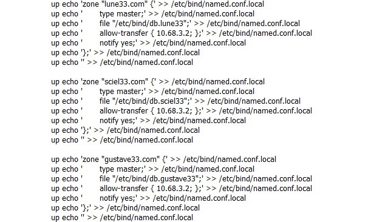

#### 2. Konfigurasi db di Node Renoir sebagai DNS Master

**a. Lune**

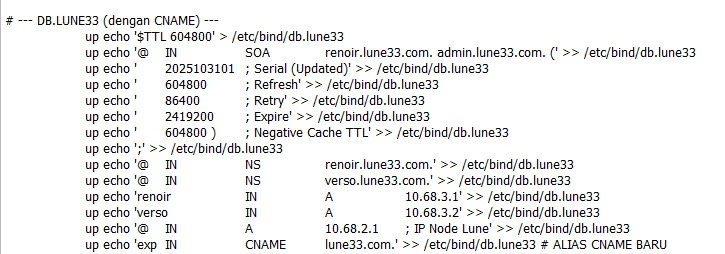

**b. Gustave**

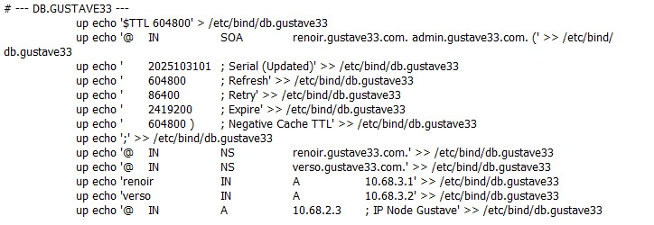

**c. Sciel**

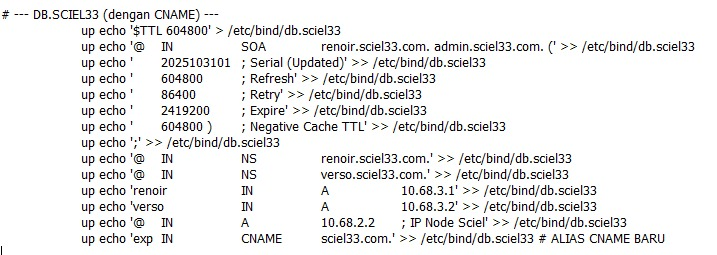

#### 3. Konfigurasi Node Verso sebagai DNS Slave
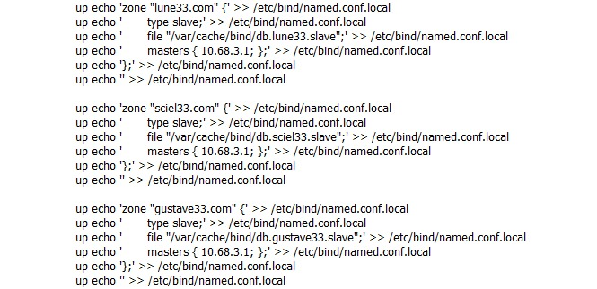

---

### Explanation

#### Cek Keberhasilan Soal 2

Untuk mengecek keberhasilan konfigurasi DNS pada Soal 2, lakukan pengujian di **client** dengan perintah berikut:

1. `dig lune33.com @10.68.3.1`  
2. `dig lune33.com @10.68.3.2`  
3. `dig sciel33.com @10.68.3.1`  
4. `dig sciel33.com @10.68.3.2`  
5. `dig gustave33.com @10.68.3.1`  
6. `dig gustave33.com @10.68.3.2`  

Selain itu, untuk memastikan bahwa domain dapat diakses dan host aktif, jalankan perintah **ping** berikut:

1. `ping lune33.com -c 4`  
2. `ping sciel33.com -c 4`  
3. `ping gustave33.com -c 4`  

Jika semua perintah `dig` dan `ping` berhasil, maka konfigurasi DNS Master (Renoir) dan DNS Slave (Verso) telah berfungsi dengan baik.

---

<br>

## Soal 3

> Tambahkan subdomain alias berupa **exp.lune33.com** yang mengarah ke alamat **lune33.com** dan **exp.sciel33.com** yang mengarah ke alamat **sciel33.com** (HINT: CNAME).  
> Selain itu, tambahkan konfigurasi untuk melakukan **reverse DNS lookup** untuk domain **gustave33.com**.

> _Subdomain Configuration_  
> _Add alias subdomains (HINT: CNAME)._  
> _exp.lune33.com → alias to lune33.com_  
> _exp.sciel33.com → alias to sciel33.com_  
> _Also, configure reverse DNS lookup for the domain gustave33.com._

---

**Answer:**

### Screenshot

#### Konfigurasi di Node Renoir

**a. Konfigurasi Zone Reverse**

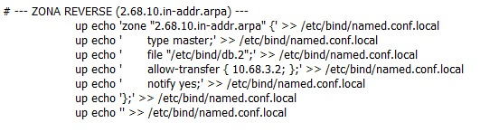

**b. Konfigurasi db.2 di Node Renoir**

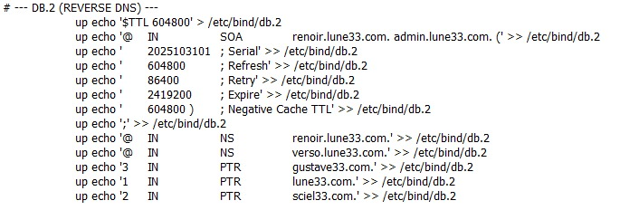

#### Konfigurasi di Node Verso

**a. Konfigurasi Zone Reverse**

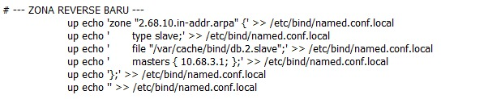

---

### Explanation

Untuk melakukan pengecekan apakah subdomain dan konfigurasi reverse DNS sudah berhasil, jalankan perintah berikut dari **client**:

1. `dig exp.lune33.com @10.68.3.1`  
   → Mengecek apakah subdomain **exp.lune33.com** berhasil diresolusikan melalui **DNS Master (Renoir)**.

2. `dig exp.lune33.com @10.68.3.2`  
   → Mengecek apakah **DNS Slave (Verso)** sudah tersinkronisasi dengan Master dan dapat meresolusikan subdomain yang sama.

3. `dig -x 10.68.2.3 @10.68.3.1`  
   → Mengecek konfigurasi **reverse DNS lookup** untuk IP **10.68.2.3** (domain **gustave33.com**) melalui **DNS Master (Renoir)**.

4. `dig exp.sciel33.com @10.68.3.1`  
   → Mengecek apakah subdomain **exp.sciel33.com** dapat diresolusikan oleh **DNS Master (Renoir)**.

5. `dig exp.sciel33.com @10.68.3.2`  
   → Mengecek apakah **DNS Slave (Verso)** juga bisa meresolusikan subdomain **exp.sciel33.com** setelah data dari Master tersinkronisasi.

---

### Bukti Keberhasilan

#### Hasil Cek Subdomain Lune

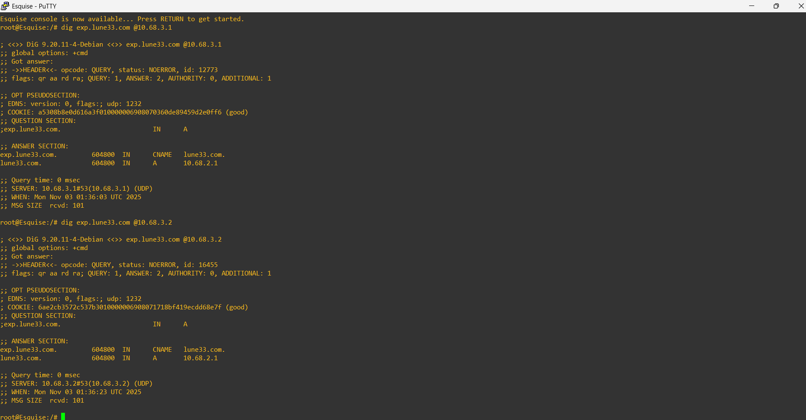

#### Hasil Cek Subdomain Sciel

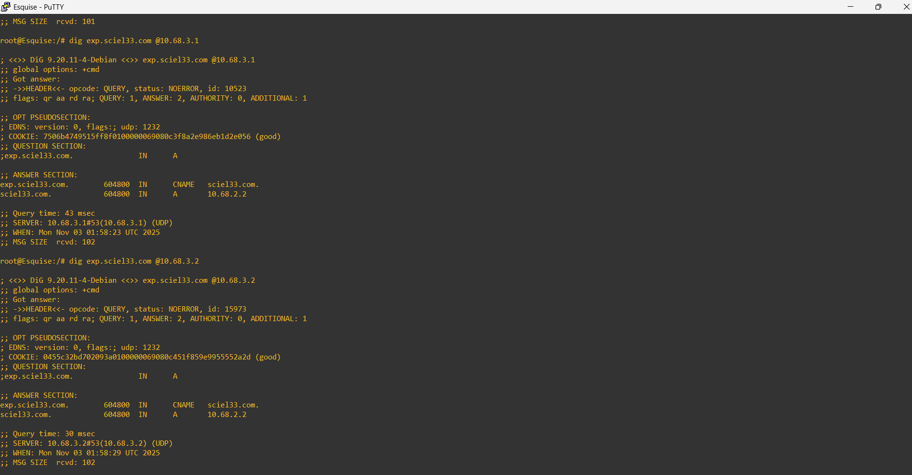

#### Hasil Cek Reverse DNS Gustave

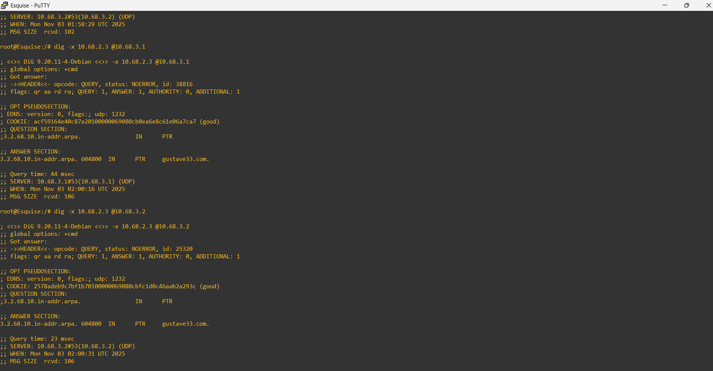

#### Ping ke Domain Utama

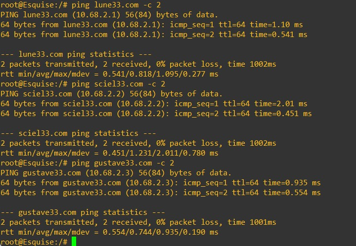

#### Ping ke Subdomain

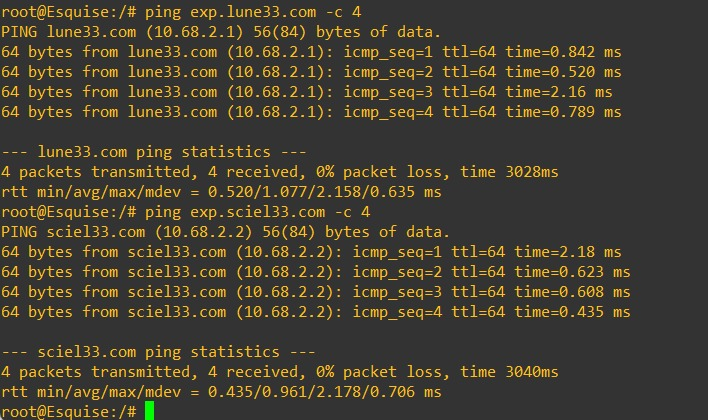

---

<br>

## Soal 4

> Buatlah subdomain berupa **expedition.gustave33.com** dan delegasikan subdomain tersebut dari **Renoir** ke **Verso** dengan alamat IP tujuan adalah node **Gustave**.  
> Kemudian, **matikan Renoir** dan coba lakukan **ping ke semua domain dan subdomain** yang telah dikonfigurasikan pada nomor 2, 3, dan 4.

> _Create a subdomain **expedition.gustave33.com** and delegate it from Renoir to Verso, with the target IP being node Gustave. Then, turn off Renoir and try pinging all domains and subdomains configured in tasks 2, 3, and 4 to verify that delegation works correctly._

---

**Answer:**

### Screenshot

#### Konfigurasi di Node Renoir
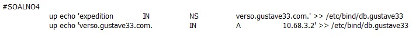

#### Konfigurasi di Node Verso
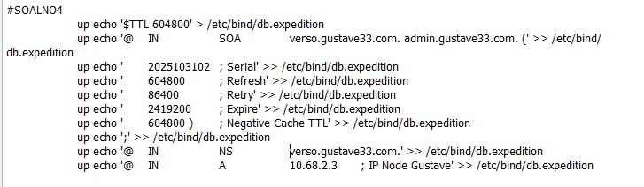

#### Hasil Pengujian Ping
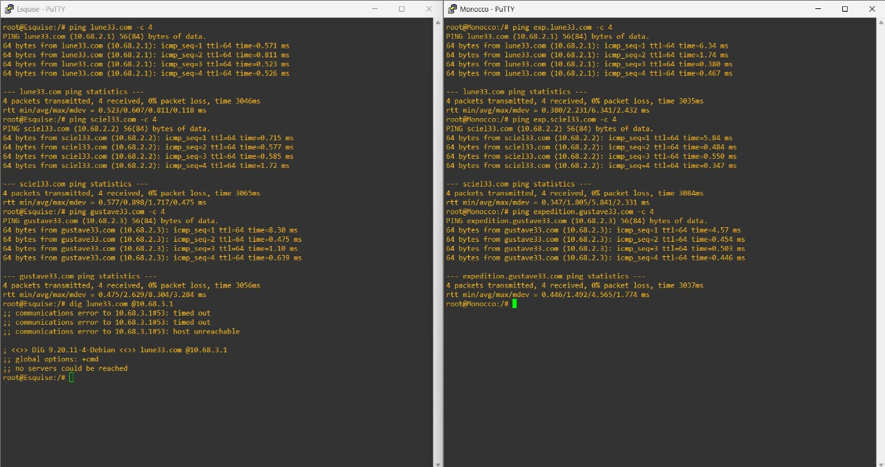

---

### Explanation

Untuk memastikan konfigurasi **delegasi subdomain expedition.gustave33.com** berjalan dengan benar, lakukan pengujian dari **client** dengan perintah berikut:

1. `ping lune33.com -c 4`  
2. `ping sciel33.com -c 4`  
3. `ping gustave33.com -c 4`  
4. `ping expedition.gustave33.com -c 4`  

---

- **Tujuan pengujian ini** adalah untuk memastikan bahwa subdomain **expedition.gustave33.com** yang telah didelegasikan dari **DNS Master (Renoir)** ke **DNS Slave (Verso)** dapat tetap diakses meskipun DNS Master dimatikan.  
  Ini membuktikan bahwa proses **delegasi DNS** berjalan dengan baik.

- **Renoir** berperan sebagai **DNS Master** yang menyimpan konfigurasi utama dan melakukan delegasi zona subdomain `expedition.gustave33.com` ke **Verso**.  
  Setelah delegasi dilakukan, **Verso** menjadi **authoritative DNS server** untuk subdomain tersebut.

- Saat **Renoir dimatikan**, DNS Slave (**Verso**) tetap dapat melayani permintaan DNS untuk domain dan subdomain yang telah disinkronkan, termasuk `lune33.com`, `sciel33.com`, `gustave33.com`, dan `expedition.gustave33.com`.

- Jika hasil `ping` menunjukkan **reply** dari masing-masing domain/subdomain, maka konfigurasi delegasi DNS sudah **berhasil**.  
  Ini menandakan:
  - Verso berfungsi sebagai DNS Slave yang aktif dan mengambil alih ketika Master tidak tersedia.  
  - Delegasi subdomain ke Verso berfungsi sebagaimana mestinya.  
  - Klien tetap dapat mengakses seluruh domain tanpa gangguan meski Renoir dimatikan.

Sebaliknya, jika muncul pesan **“unknown host”** atau **“temporary failure in name resolution”**, berarti proses delegasi atau konfigurasi zona pada Verso belum benar.

---

## Soal 5

> Konfigurasi node **Lune**, **Sciel**, dan **Gustave** agar berfungsi sebagai web server **Nginx** yang menyajikan halaman profil berbeda di setiap node.  
> Gunakan:
> - `profile_lune.html` untuk node Lune  
> - `profile_sciel.html` untuk node Sciel  
> - `profile_gustave.html` untuk node Gustave  
> 
> Selain itu, konfigurasikan **custom log** di masing-masing server:
> - Access log: `/tmp/access.log`  
> - Error log: `/tmp/error.log`  

> _Configure Lune, Sciel, and Gustave as Nginx web servers serving profile pages with custom logs._

---

**Answer:**

### Screenshot

#### Uji Coba dengan Curl
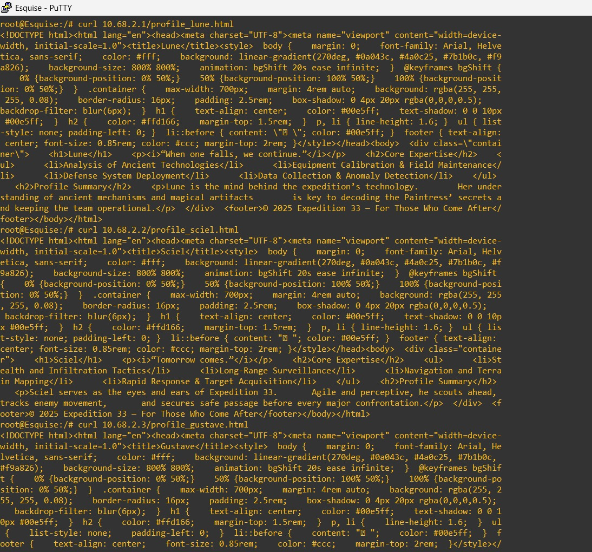

---

### Explanation

#### 1. Pembuatan File Profil & Direktori Root  
Langkah pertama adalah membuat **folder root web** dan **file profil HTML** di masing-masing node.  
Setiap file berisi konten profil unik sesuai nama nodenya.

---

#### 2. Konfigurasi Virtual Host & Log di NGINX  
Masing-masing node (Lune, Sciel, Gustave) dikonfigurasi agar:
- Menyajikan file HTML dari `/var/www/[nama_node]/profile_[nama_node].html`
- Menyimpan **access log** di `/tmp/access.log`
- Menyimpan **error log** di `/tmp/error.log`

Konfigurasi ini memastikan setiap web server memiliki log-nya sendiri tanpa saling tumpang tindih, memudahkan proses debugging dan pemantauan aktivitas.

---

### Konfigurasi Setiap Node

#### Node Lune
```bash
# Membuat direktori dan file HTML untuk Lune
up mkdir -p /var/www/lune

up echo '<!DOCTYPE html>
<html lang="en">
<head>
<meta charset="UTF-8">
<meta name="viewport" content="width=device-width, initial-scale=1.0">
<title>Lune</title>
<style>
  body {
    margin: 0;
    font-family: Arial, Helvetica, sans-serif;
    color: #fff;
    background: linear-gradient(270deg, #0a043c, #4a0c25, #7b1b0c, #f9a826);
    background-size: 800% 800%;
    animation: bgShift 20s ease infinite;
  }
  @keyframes bgShift {
    0% {background-position: 0% 50%;}
    50% {background-position: 100% 50%;}
    100% {background-position: 0% 50%;}
  }
  .container {
    max-width: 700px;
    margin: 4rem auto;
    background: rgba(255, 255, 255, 0.08);
    border-radius: 16px;
    padding: 2.5rem;
    box-shadow: 0 4px 20px rgba(0,0,0,0.5);
    backdrop-filter: blur(6px);
  }
  h1 {
    text-align: center;
    color: #00e5ff;
    text-shadow: 0 0 10px #00e5ff;
  }
  h2 { color: #ffd166; margin-top: 1.5rem; }
  p, li { line-height: 1.6; }
  ul { list-style: none; padding-left: 0; }
  li::before { content: "▹ "; color: #00e5ff; }
  footer { text-align: center; font-size: 0.85rem; color: #ccc; margin-top: 2rem; }
</style>
</head>
<body>
  <div class="container">
    <h1>Lune</h1>
    <p><i>“When one falls, we continue.”</i></p>

    <h2>Core Expertise</h2>
    <ul>
      <li>Analysis of Ancient Technologies</li>
      <li>Equipment Calibration & Field Maintenance</li>
      <li>Defense System Deployment</li>
      <li>Data Collection & Anomaly Detection</li>
    </ul>

    <h2>Profile Summary</h2>
    <p>Lune is the mind behind the expedition’s technology.
       Her understanding of ancient mechanisms and magical artifacts
       is key to decoding the Paintress’ secrets and keeping the team operational.</p>
  </div>

  <footer>© 2025 Expedition 33 — For Those Who Come After</footer>
</body>
</html>' > /var/www/lune/profile_lune.html
````

---

#### Node Sciel

```bash
# Membuat direktori dan file HTML untuk Sciel
up mkdir -p /var/www/sciel

up echo '<!DOCTYPE html>
<html lang="en">
<head>
<meta charset="UTF-8">
<meta name="viewport" content="width=device-width, initial-scale=1.0">
<title>Sciel</title>
<style>
  body {
    margin: 0;
    font-family: Arial, Helvetica, sans-serif;
    color: #fff;
    background: linear-gradient(270deg, #0a043c, #4a0c25, #7b1b0c, #f9a826);
    background-size: 800% 800%;
    animation: bgShift 20s ease infinite;
  }
  @keyframes bgShift {
    0% {background-position: 0% 50%;}
    50% {background-position: 100% 50%;}
    100% {background-position: 0% 50%;}
  }
  .container {
    max-width: 700px;
    margin: 4rem auto;
    background: rgba(255, 255, 255, 0.08);
    border-radius: 16px;
    padding: 2.5rem;
    box-shadow: 0 4px 20px rgba(0,0,0,0.5);
    backdrop-filter: blur(6px);
  }
  h1 {
    text-align: center;
    color: #00e5ff;
    text-shadow: 0 0 10px #00e5ff;
  }
  h2 { color: #ffd166; margin-top: 1.5rem; }
  p, li { line-height: 1.6; }
  ul { list-style: none; padding-left: 0; }
  li::before { content: "▹ "; color: #00e5ff; }
  footer { text-align: center; font-size: 0.85rem; color: #ccc; margin-top: 2rem; }
</style>
</head>
<body>
  <div class="container">
    <h1>Sciel</h1>
    <p><i>“Tomorrow comes.”</i></p>

    <h2>Core Expertise</h2>
    <ul>
      <li>Stealth and Infiltration Tactics</li>
      <li>Long-Range Surveillance</li>
      <li>Navigation and Terrain Mapping</li>
      <li>Rapid Response & Target Acquisition</li>
    </ul>

    <h2>Profile Summary</h2>
    <p>Sciel serves as the eyes and ears of Expedition 33.
       Agile and perceptive, he scouts ahead, tracks enemy movement,
       and secures safe passage before every major confrontation.</p>
  </div>

  <footer>© 2025 Expedition 33 — For Those Who Come After</footer>
</body>
</html>' > /var/www/sciel/profile_sciel.html
```

---

#### Node Gustave

```bash
# Membuat direktori dan file HTML untuk Gustave
up mkdir -p /var/www/gustave

up echo '<!DOCTYPE html>
<html lang="en">
<head>
<meta charset="UTF-8">
<meta name="viewport" content="width=device-width, initial-scale=1.0">
<title>Gustave</title>
<style>
  body {
    margin: 0;
    font-family: Arial, Helvetica, sans-serif;
    color: #fff;
    background: linear-gradient(270deg, #0a043c, #4a0c25, #7b1b0c, #f9a826);
    background-size: 800% 800%;
    animation: bgShift 20s ease infinite;
  }
  @keyframes bgShift {
    0% {background-position: 0% 50%;}
    50% {background-position: 100% 50%;}
    100% {background-position: 0% 50%;}
  }
  .container {
    max-width: 700px;
    margin: 4rem auto;
    background: rgba(255, 255, 255, 0.08);
    border-radius: 16px;
    padding: 2.5rem;
    box-shadow: 0 4px 20px rgba(0,0,0,0.5);
    backdrop-filter: blur(6px);
  }
  h1 { text-align: center; color: #00e5ff; text-shadow: 0 0 10px #00e5ff; }
  h2 { color: #ffd166; margin-top: 1.5rem; }
  p, li { line-height: 1.6; }
  ul { list-style: none; padding-left: 0; }
  li::before { content: "▹ "; color: #00e5ff; }
  footer { text-align: center; font-size: 0.85rem; color: #ccc; margin-top: 2rem; }
</style>
</head>
<body>
  <div class="container">
    <h1>Gustave</h1>
    <p><i>“For those who come after. Right?”</i></p>

    <h2>Core Expertise</h2>
    <ul>
      <li>Tactical Combat Planning</li>
      <li>Frontline Leadership & Morale Management</li>
      <li>Heavy Weapon Proficiency</li>
      <li>Risk Assessment & Survival Techniques</li>
    </ul>

    <h2>Profile Summary</h2>
    <p>Gustave is a battle-hardened veteran and the backbone of Expedition 33.
       With experience from countless missions, he oversees every tactical decision
       made in the war against the Paintress.</p>
  </div>

  <footer>© 2025 Expedition 33 — For Those Who Come After</footer>
</body>
</html>' > /var/www/gustave/profile_gustave.html
```

---

### 3. Pengujian

Gunakan perintah berikut dari **client** untuk memastikan web server berfungsi dengan benar:

```bash
curl http://lune33.com
curl http://sciel33.com
curl http://gustave33.com
```

Jika konfigurasi benar, masing-masing perintah akan menampilkan halaman profil yang berbeda sesuai node-nya.

---

### Kesimpulan

* Setiap node (**Lune**, **Sciel**, dan **Gustave**) telah dikonfigurasi sebagai **web server Nginx** dengan halaman profil masing-masing.
* Custom log di `/tmp/access.log` dan `/tmp/error.log` membantu memantau aktivitas akses dan error tanpa mengganggu log utama Nginx.
* Hasil `curl` menunjukkan bahwa **setiap domain menampilkan konten unik**, menandakan konfigurasi virtual host dan direktori root sudah berhasil.

---

## Soal 6

> Setelah website berhasil dideploy pada masing-masing node web server dan halaman dapat menampilkan profil yang sesuai, buatlah **custom access log** ke file `/tmp/access.log` di masing-masing node web server menggunakan format log tertentu seperti di bawah:
> 
> - Tanggal dan waktu akses (format standar log)
> - Nama node yang sedang diakses
> - Alamat IP klien yang mengakses website
> - Metode HTTP dan URI yang diakses
> - Status respons HTTP yang diberikan oleh server
> - Jumlah byte yang dikirimkan dalam respons
> - Waktu yang dihabiskan oleh server untuk menangani permintaan
>
> Contoh format log:
> ```
> [01/Oct/2024:11:30:45 +0000] Jarkom Node Lune Access from 192.168.1.15 using method "GET /resep/bayam HTTP/1.1" returned status 200 with 2567 bytes sent in 0.038 seconds
> ```

> _Create a custom access log in `/tmp/access.log` for each web server (Lune, Sciel, Gustave) using the specified log format._

---

**Answer:**

### Screenshot

#### Konfigurasi Format Log Masing-Masing Node (Sesuaikan Nama Node)
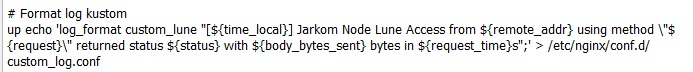

#### Cek Keberhasilan Log Masing-Masing Node Web Server
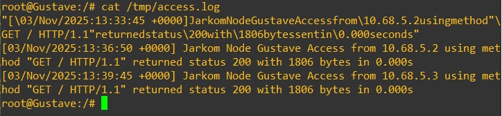  
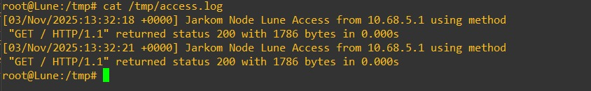  
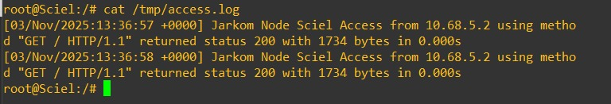

---

### Explanation

#### Langkah-Langkah Konfigurasi Custom Log Format

1. **Edit konfigurasi NGINX di masing-masing node web server (Lune, Sciel, Gustave)** — biasanya pada file:
````

/etc/nginx/sites-available/default

````
2. Tambahkan blok berikut di dalam konfigurasi:

#### Contoh untuk Node Lune

``` bash
up echo 'log_format custom_lune "[${time_local}] Jarkom Node Lune Access from ${remote_addr} using method \"${request}\" returned status ${status} with ${body_bytes_sent} bytes in ${request_time}s";' > /etc/nginx/conf.d/custom_log.conf
```

> Ubah `Node Lune` sesuai dengan nama node (contoh: `Node Sciel`, `Node Gustave`).

---

#### Cek Keberhasilan Custom Log

Untuk membuktikan bahwa format log sudah berjalan dengan benar, lakukan pengujian berikut dari node **client** (misalnya Esquise, Monocco, atau Maelle):

1. Kirim permintaan HTTP ke masing-masing web server:

   ```bash
   curl http://lune33.com
   curl http://sciel33.com
   curl http://gustave33.com
   curl http://expedition.gustave33.com
   ```

2. Kemudian, lihat hasil log di setiap web server:

   ```bash
   cat /tmp/access.log
   cat /tmp/error.log
   ```

---

* **Tujuan utama custom log format** ini adalah untuk memberikan **informasi yang lebih spesifik dan mudah dibaca** dibanding log bawaan NGINX.
  Dengan menambahkan nama node dan informasi lengkap (IP klien, metode HTTP, URI, status kode, dan waktu eksekusi), administrator jaringan dapat dengan cepat:

  * Mengidentifikasi node mana yang sedang diakses.
  * Melihat asal permintaan (alamat IP klien).
  * Mengevaluasi performa dan waktu respons server.
  * Melakukan troubleshooting jika ada error atau lonjakan trafik.

* **Custom access log (`/tmp/access.log`)** → mencatat semua aktivitas akses (baik dari user maupun client internal).

* **Custom error log (`/tmp/error.log`)** → mencatat semua kesalahan atau kegagalan pemrosesan request.

Dengan demikian, log ini bukan hanya sekadar catatan akses, tetapi juga **alat monitoring penting** untuk mengevaluasi **keamanan, stabilitas, dan performa server**.

---

### Kesimpulan

* Setiap node web server (**Lune**, **Sciel**, dan **Gustave**) kini memiliki custom log yang menampilkan format akses secara detail.
* Log ini memungkinkan analisis lalu lintas jaringan dan performa aplikasi dengan lebih efisien.
* Hasil pengujian `curl` dari client menunjukkan bahwa request berhasil terekam sesuai format log yang telah ditentukan.

---

## Soal 7

> Gustave merupakan web server yang tidak disarankan untuk dilihat oleh publik. Maka dari itu, ubahlah konfigurasi nginx sehingga halaman profil Gustave menjadi hanya bisa diakses melalui port 8080 dan 8888.

> *The Gustave web server should not be publicly accessible.
> Modify the Nginx configuration so that Gustave’s profile page can only be accessed through ports 8080 and 8888.*

---

**Answer:**

* **Screenshot**

  **Pengujian Akses Port Gustave**
  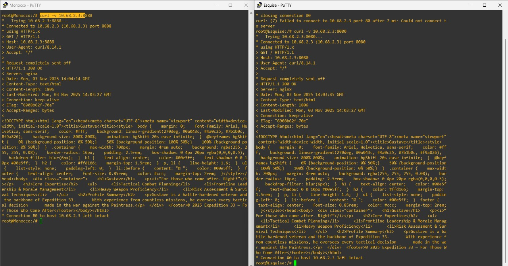

---

* **Explanation**

1. **Ubah dan  konfigurasi port baru pada NGINX di Node Gustave:**

   Jalankan perintah berikut untuk menambahkan dua port tambahan (8080 dan 8888) agar web server Gustave hanya merespons di port tersebut.

   ```bash
   up echo '    listen 8080;' >> /etc/nginx/sites-available/default
   up echo '    listen 8888;' >> /etc/nginx/sites-available/default
   ```

  **Penjelasan:**

   * Baris `listen 8080;` dan `listen 8888;` membuat NGINX mendengarkan (listen) koneksi HTTP pada port 8080 dan 8888.
   * Dengan konfigurasi ini, server **tidak lagi menerima koneksi di port default 80**, sehingga akses melalui `curl gustave33.com` tanpa menyebutkan port akan **gagal (connection refused)**.
   * Hanya permintaan dengan port yang disebut secara eksplisit (`curl gustave33.com:8080` atau `curl gustave33.com:8888`) yang akan berhasil.

2. **Uji hasil konfigurasi:**

   * **Coba akses dengan port default (tanpa port):**

     ```bash
     curl gustave33.com
     ```

    **Hasil:** gagal — karena port 80 tidak lagi digunakan.

   * **Coba akses dengan port yang telah diset:**

     ```bash
     curl gustave33.com:8080
     curl gustave33.com:8888
     ```

    **Hasil:** berhasil menampilkan halaman profil Gustave.

3. **Tujuan pengaturan ini:**

   * Membatasi akses publik hanya untuk pengguna atau sistem yang mengetahui port khusus.
   * Port `8080` dan `8888` biasanya digunakan untuk layanan internal atau testing environment, bukan untuk trafik publik biasa.
   * Dengan memindahkan layanan dari port 80 ke port non-standar, server menjadi **lebih aman** karena tidak mudah diakses secara umum, sejalan dengan kebutuhan “tidak disarankan untuk publik”.

---

## Soal 8

> Untuk mempermudah program ekspedisi, maka node Lune, Sciel, Gustave sepakat untuk membuat halaman informasi dengan konten yang sama. Maka dari itu, buatlah lagi 1 server block di dalam konfigurasi nginx yang akan menyajikan file HTML ini. Namun, mereka ingin menyajikan halaman informasi tersebut di port yang berbeda-beda, yaitu Lune menggunakan port 8000, Sciel menggunakan port 8100, dan Gustave menggunakan port 8200.

> *To simplify coordination for the expedition program, Lune, Sciel, and Gustave agree to create a shared information page with the same content. Add one more server block in each node’s Nginx configuration that serves this HTML file.
> Each node should serve the information page on a different port:*
> *- Lune → port 8000*
> *- Sciel → port 8100*
> *- Gustave → port 8200*

---

**Answer:**

* **Screenshot**

  **Konfigurasi dan Pengujian Halaman Info**
  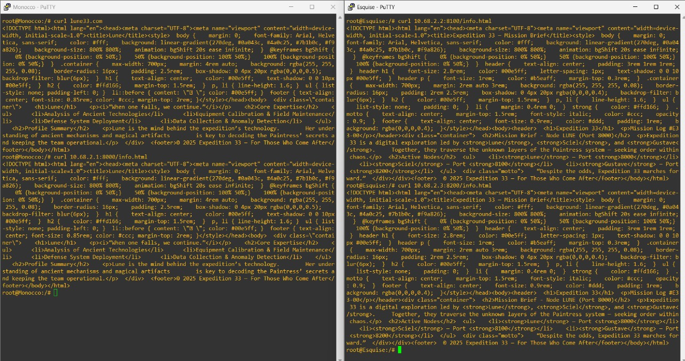

---

* **Explanation**

1. **Buat file `info.html` di masing-masing node:**

   Jalankan perintah berikut di masing-masing node, dan ubah `[node_webserver]` sesuai dengan nama node (misal: `lune`, `sciel`, `gustave`):

   ```bash
   up echo '<!DOCTYPE html>\
   <html lang="en">\
   <head>\
   <meta charset="UTF-8">\
   <meta name="viewport" content="width=device-width, initial-scale=1.0">\
   <title>Expedition 33 — Mission Brief</title>\
   <style>\
     body { margin: 0; font-family: Arial, Helvetica, sans-serif; color: #fff; background: linear-gradient(270deg, #0a043c, #4a0c25, #7b1b0c, #f9a826); background-size: 800% 800%; animation: bgShift 20s ease infinite; }\
     @keyframes bgShift { 0% {background-position: 0% 50%;} 50% {background-position: 100% 50%;} 100% {background-position: 0% 50%;} }\
     header { text-align: center; padding: 3rem 1rem 1rem; }\
     header h1 { font-size: 2.8rem; color: #00e5ff; text-shadow: 0 0 10px #00e5ff; }\
     .container { max-width: 700px; margin: 2rem auto 3rem; background: rgba(255,255,255,0.08); border-radius: 16px; padding: 2rem 2.5rem; box-shadow: 0 4px 20px rgba(0,0,0,0.4); }\
     h2 { color: #00e5ff; margin-top: 1.5rem; }\
     strong { color: #ffd166; }\
     footer { text-align: center; font-size: 0.9rem; color: #ddd; padding: 1rem; background: rgba(0,0,0,0.4); }\
   </style>\
   </head>\
   <body>\
   <header>\
     <h1>Expedition 33</h1>\
     <p>Mission Log #E33-00</p>\
   </header>\
   <div class="container">\
     <h2>Mission Brief - Node LUNE (Port 8000)</h2>\
     <p>Expedition 33 is a digital exploration led by <strong>Lune</strong>, <strong>Sciel</strong>, and <strong>Gustave</strong>.</p>\
     <h2>Active Nodes</h2>\
     <ul>\
       <li><strong>Lune</strong> — Port <strong>8000</strong></li>\
       <li><strong>Sciel</strong> — Port <strong>8100</strong></li>\
       <li><strong>Gustave</strong> — Port <strong>8200</strong></li>\
     </ul>\
   </div>\
   <footer>© 2025 Expedition 33 — For Those Who Come After</footer>\
   </body>\
   </html>' > /var/www/[node_webserver]/info.html
   ```

---

2. **Tambahkan konfigurasi server block baru untuk halaman info:**

   Sesuaikan port, direktori root, dan nama node masing-masing.

   ```bash
   up echo 'server {' >> /etc/nginx/sites-available/default
   up echo '    listen port;' >> /etc/nginx/sites-available/default          # sesuaikan port
   up echo '    root /var/www/node;' >> /etc/nginx/sites-available/default   # sesuaikan direktori root node
   up echo '    index info.html;' >> /etc/nginx/sites-available/default
   up echo '    server_name gustave33.com expedition.gustave33.com;' >> /etc/nginx/sites-available/default
   up echo '' >> /etc/nginx/sites-available/default
   up echo '    # Log Kustom' >> /etc/nginx/sites-available/default
   up echo '    access_log /tmp/access.log custom_node;' >> /etc/nginx/sites-available/default  # sesuaikan nama node
   up echo '    error_log /tmp/error.log;' >> /etc/nginx/sites-available/default
   up echo '' >> /etc/nginx/sites-available/default
   up echo '    location / {' >> /etc/nginx/sites-available/default
   up echo '        try_files $uri $uri/ =404;' >> /etc/nginx/sites-available/default
   up echo '    }' >> /etc/nginx/sites-available/default
   up echo '}' >> /etc/nginx/sites-available/default
   ```

---

3. **Hasil konfigurasi port per node:**

   | Node        | Port Aktif       | Keterangan                                                                    |
   | ----------- | ---------------- | ----------------------------------------------------------------------------- |
   | **Lune**    | 80, 8000         | Port 80 untuk profil utama, 8000 untuk halaman info                           |
   | **Sciel**   | 80, 8100         | Port 80 untuk profil utama, 8100 untuk halaman info                           |
   | **Gustave** | 8080, 8200, 8888 | Port 8080 & 8888 untuk profil utama (akses terbatas), 8200 untuk halaman info |

---

4. **Cek hasil dengan perintah `curl`:**

   ```bash
   # Lune
   curl lune33.com:8000

   # Sciel
   curl sciel33.com:8100

   # Gustave
   curl gustave33.com:8200
   ```

   **Hasil:** menampilkan halaman **info.html** Expedition 33 pada masing-masing port sesuai konfigurasi.
   Jika mencoba port lain yang tidak dikonfigurasi (misalnya `curl gustave33.com:80`), maka hasilnya akan **gagal (connection refused)** karena server tidak mendengarkan di port tersebut.

---

5. **Tujuan pengaturan port ini:**

   * Untuk **membedakan layanan utama dan halaman informasi**. Profil masing-masing node tetap di port lama, sedangkan halaman informasi umum Expedition 33 tersedia di port baru.
   * Port berbeda digunakan agar **setiap layanan dapat diatur atau diuji secara terpisah** tanpa bentrok dengan konfigurasi utama.
   * Dengan demikian, masing-masing node punya:

     * **Situs utama (profil individual)**
     * **Situs tambahan (halaman info bersama)**
       yang bisa diakses hanya pada port tertentu.


---

## Soal 9

> Untuk mempermudah akses ke profil tiap anggota ekspedisi, buatlah satu domain lagi yaitu **`expeditioners.com`** yang akan mengarah ke **Alicia**.
> Lalu, untuk mencegah overload dari salah satu web server, konfigurasikan reverse proxy **Alicia** agar bisa *forward request* ke server yang sesuai berdasarkan URL profil yang diminta oleh klien, dengan ketentuan sebagai berikut:
>
> * Request untuk `expeditioners.com/profil_lune` harus dialihkan ke halaman profil web server **Lune**.
> * Request untuk `expeditioners.com/profil_sciel` harus dialihkan ke halaman profil web server **Sciel**.
> * Request untuk `expeditioners.com/profil_gustave` harus dialihkan ke halaman profil web server **Gustave**.
> * Jika terdapat request ke URL selain profil yang ditentukan, reverse proxy akan mengalihkan ke halaman informasi pada web server **Lune**.

> *To make it easier to access each member’s profile, create a new domain `expeditioners.com` that points to Alicia.*
> *Configure Alicia’s reverse proxy (Nginx) to forward requests to the correct web server based on the requested URL, with the following rules:*
>
> * *Request URL `expeditioners.com/profil_lune` → Forward to Lune’s profile page*
> * *Request URL `expeditioners.com/profil_sciel` → Forward to Sciel’s profile page*
> * *Request URL `expeditioners.com/profil_gustave` → Forward to Gustave’s profile page*
> * *Any other URL → Forward to Lune’s information page*

---

### **Answer**

#### Screenshot

**Tambahkan di node Renoir**

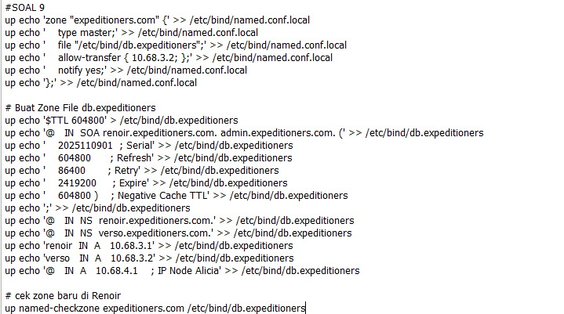

**Tambahkan di node Verso**

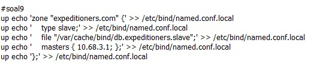

**Tambahkan di node Alicia**

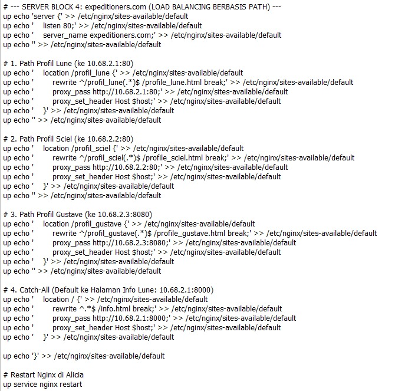

**Cek Keberhasilan**

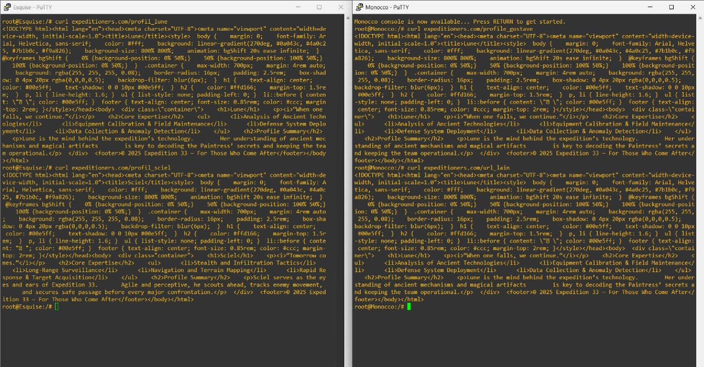

---

### Explanation

#### 1. Konfigurasi DNS dan Reverse Proxy

Konfigurasi ini bertujuan membangun **Application Gateway (Reverse Proxy)** di **Alicia**, yang mampu merutekan lalu lintas berdasarkan path URL yang diminta.

##### a. Konfigurasi DNS (`expeditioners.com`)

* Domain `expeditioners.com` ditambahkan di DNS Master **Renoir** dan direplikasi ke **Verso**.
* **A Record** utama domain ini menunjuk ke IP Reverse Proxy **Alicia (`10.68.4.1`)**.

##### b. Konfigurasi Reverse Proxy (Nginx di Alicia)

Nginx di **Alicia** dikonfigurasi dengan *Server Block* untuk `expeditioners.com` menggunakan *location blocks* dan *rewrite rules* untuk distribusi berdasarkan path:

* **Rute Spesifik (`/profil_nama`)**
  Location block ini memetakan URL ramah pengguna menjadi file profil sebenarnya (`/profile_nama.html`) dan meneruskannya ke web server terkait (misalnya **Gustave** di port `8080`).

* **Catch-All (Fallback)**
  Blok `location /` diatur sebagai default. Jika path URL tidak cocok dengan salah satu profil, request di-*rewrite* ke `/info.html` dan diteruskan ke **Lune** di port `8000` (layanan informasi).

---

#### 2. Hasil Pengujian (Tes `curl`)

Pengujian dari client membuktikan Reverse Proxy berfungsi dengan benar:

| Perintah `curl`                         | Tujuan Terpenuhi    | Hasil yang Dicapai                                   |
| --------------------------------------- | ------------------- | ---------------------------------------------------- |
| `curl expeditioners.com/profil_lune`    | Rute Profil Lune    | Menampilkan konten profil Lune                       |
| `curl expeditioners.com/profil_sciel`   | Rute Profil Sciel   | Menampilkan konten profil Sciel                      |
| `curl expeditioners.com/profil_gustave` | Rute Profil Gustave | Menampilkan konten profil Gustave (via port 8080)    |
| `curl expeditioners.com/url_lain`       | Rute Catch-All      | Menampilkan konten halaman informasi (via Lune:8000) |

---

## Soal 10

> Untuk mendistribusikan traffic halaman informasi, atur Reverse Proxy Alicia agar dapat membagi pekerjaan kepada web server Lune, Sciel, dan Gustave secara optimal menggunakan algoritma **Round-robin**.
> Pastikan target pembagian load merupakan **halaman informasi**, bukan halaman profil masing-masing web server.

> *To distribute traffic for the information page, configure the reverse proxy (Alicia) to use Round-robin load balancing between the three web servers: Lune, Sciel, and Gustave.*
> *Ensure that only the information page is included in the load-balancing configuration — not the profile pages.*

---

**Answer:**

* **Screenshot**

  **Tambahkan di node Alicia**

  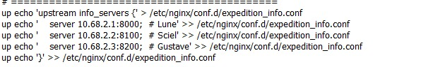

  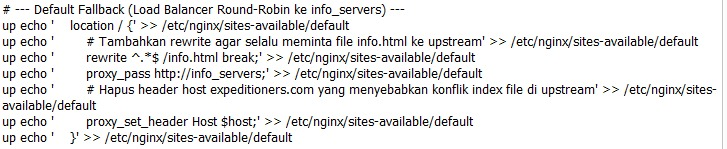

  **Cek Keberhasilan**
  
  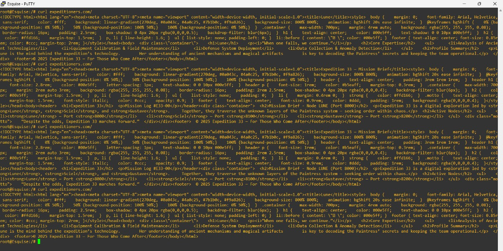

---

* **Explanation**

  1. **Tujuan Konfigurasi**

     Soal ini mengharuskan konfigurasi **Reverse Proxy (Alicia)** untuk melakukan *load balancing* menggunakan algoritma **Round-robin**, khusus pada **halaman informasi** (`/info.html`).
     Dengan demikian, setiap kali klien mengakses `expeditioners.com/info.html`, request akan dibagi rata ke tiga web server backend:

     * Lune → `10.68.2.1:8000`
     * Sciel → `10.68.2.2:8100`
     * Gustave → `10.68.2.3:8200`

  2. **Langkah Konfigurasi**

     * Buat atau tambahkan blok `upstream expedition_info` di konfigurasi Nginx untuk mendefinisikan tiga backend server.
     * Gunakan *server block* pada domain `expeditioners.com` untuk mengatur path:

       * `/profil_lune`, `/profil_sciel`, dan `/profil_gustave` diarahkan langsung ke masing-masing web server.
       * `/` (atau `/info.html`) diarahkan ke `upstream expedition_info`, yang otomatis mendistribusikan beban secara **Round-robin**.
     * Restart Nginx untuk menerapkan perubahan.

  3. **Contoh Cuplikan Konfigurasi (Alicia)**

     ```nginx
     upstream expedition_info {
         server 10.68.2.1:8000;  # Lune
         server 10.68.2.2:8100;  # Sciel
         server 10.68.2.3:8200;  # Gustave
     }

     server {
         listen 80;
         server_name expeditioners.com;

         # Profil Lune
         location /profil_lune {
             proxy_pass http://10.68.2.1:80;
             proxy_set_header Host $host;
         }

         # Profil Sciel
         location /profil_sciel {
             proxy_pass http://10.68.2.2:80;
             proxy_set_header Host $host;
         }

         # Profil Gustave
         location /profil_gustave {
             proxy_pass http://10.68.2.3:8080;
             proxy_set_header Host $host;
         }

         # Load Balancing Halaman Informasi (Round Robin)
         location / {
             proxy_pass http://expedition_info;
             proxy_set_header Host $host;
         }
     }
     ```

  4. **Hasil Pengujian**

     * Saat dilakukan `curl` beberapa kali ke `http://expeditioners.com/info.html`, konten yang tampil berasal bergantian dari Lune, Sciel, dan Gustave, menandakan **Round-robin load balancing** berfungsi dengan baik.
     * Profil masing-masing tetap langsung diarahkan ke server spesifiknya tanpa terpengaruh oleh mekanisme load balancing.

---