[](https://classroom.github.com/a/oYnIPZ_t)
| Name                 | NRP        | Kelas |
|----------------------|------------|-------|
| Angela Vania Sugiyono | 5025241226 | A     |


## Put your topology config image here!

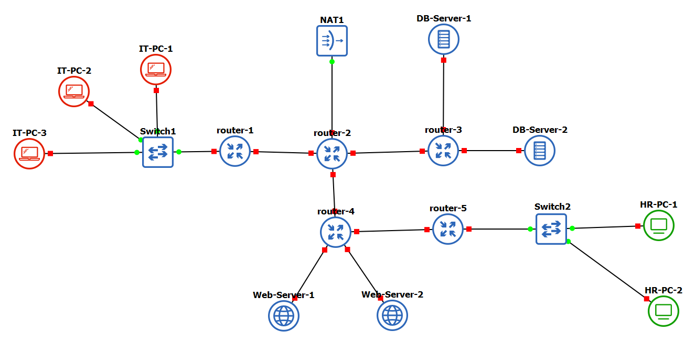

## Put your GNS3 Project file here!

[praktikum4](praktikum4full_angela.gns3project)

<br>

## Soal 1

> Lakukan subnetting pada topologi diatas menggunakan metode VLSM: [Referensi](https://github.com/arsitektur-jaringan-komputer/Modul-Jarkom/tree/master/Modul-4/Subnetting#2-vlsm-variable-length-subnet-masking)  
*Cantumkan juga tabel dan diagram pembagian subnet pada laporan praktikum*.

> _Subnet the topology above using the VLSM method: [Reference](https://github.com/arsitektur-jaringan-komputer/Modul-Jarkom/tree/master/Modul-4/Subnetting#2-vlsm-variable-length-subnet-masking)_  
_Also include the subnet table and diagram in the lab report._

**Answer:**

- **Screenshot**

  **1. Pengelompokan Node & Topologi:**
  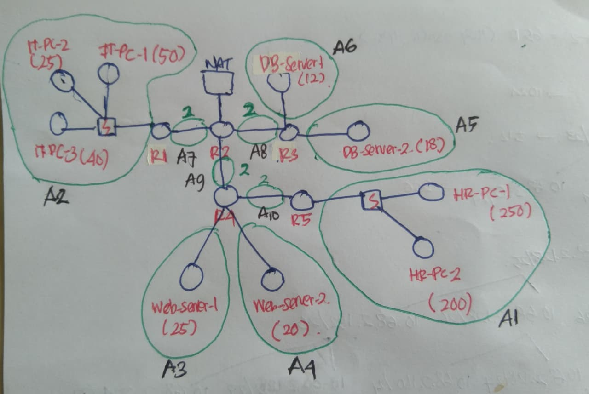

  **2. Diagram VLSM Tree:**
  

- **Explanation**

  Berikut adalah langkah-langkah pengerjaan subnetting menggunakan metode VLSM (*Variable Length Subnet Mask*):

  1.  **Identifikasi & Grouping (Pengelompokan):**
      Langkah pertama adalah mengelompokkan *device* berdasarkan *broadcast domain* (router interface/switch) untuk menentukan jumlah host yang dibutuhkan per subnet. Link yang mengarah ke **NAT1** tidak dihitung dalam VLSM ini karena diasumsikan sebagai link ke internet (ISP) yang menggunakan konfigurasi IP Public/DHCP terpisah.
      * **A1 (HR LAN):** Menggabungkan HR-PC1 dan HR-PC2 (Total 450 Host).
      * **A2 (IT LAN):** Menggabungkan IT-PC1, IT-PC2, dan IT-PC3 (Total 115 Host).
      * **Servers (A3-A6):** Masing-masing server berada di segmen jaringan mandiri.
      * **Router Links (A7-A10):** Koneksi *Point-to-Point* antar router internal.

  2.  **Sorting (Pengurutan):**
      Alokasi IP dilakukan urut dari kebutuhan host **terbesar ke terkecil** untuk efisiensi:
      * Urutan: A1 (450) $\rightarrow$ A2 (115) $\rightarrow$ Server $\rightarrow$ Link Router.

  3.  **Subnetting & Tabel Alokasi:**
      IP Network dimulai dari `10.68.0.0`.

| Label | Nama Subnet | Kebutuhan Host | Netmask (CIDR) | Network ID | Broadcast Address | Range IP Usable |
| :--- | :--- | :--- | :--- | :--- | :--- | :--- |
| **A1** | HR LAN | 450 | /23 | 10.68.0.0 | 10.68.1.255 | 10.68.0.1 - 10.68.1.254 |
| **A2** | IT LAN | 115 | /25 | 10.68.2.0 | 10.68.2.127 | 10.68.2.1 - 10.68.2.126 |
| **A3** | Web-Server-1 | 25 | /27 | 10.68.2.128 | 10.68.2.159 | 10.68.2.129 - 10.68.2.158 |
| **A4** | Web-Server-2 | 20 | /27 | 10.68.2.160 | 10.68.2.191 | 10.68.2.161 - 10.68.2.190 |
| **A5** | DB-Server-2 | 18 | /27 | 10.68.2.192 | 10.68.2.223 | 10.68.2.193 - 10.68.2.222 |
| **A6** | DB-Server-1 | 12 | /28 | 10.68.2.224 | 10.68.2.239 | 10.68.2.225 - 10.68.2.238 |
| **A7** | Link R1-R2 | 2 | /30 | 10.68.2.240 | 10.68.2.243 | 10.68.2.241 - 10.68.2.242 |
| **A8** | Link R2-R3 | 2 | /30 | 10.68.2.244 | 10.68.2.247 | 10.68.2.245 - 10.68.2.246 |
| **A9** | Link R2-R4 | 2 | /30 | 10.68.2.248 | 10.68.2.251 | 10.68.2.249 - 10.68.2.250 |
| **A10** | Link R4-R5 | 2 | /30 | 10.68.2.252 | 10.68.2.255 | 10.68.2.253 - 10.68.2.254 |

> **Kesimpulan:** Dengan konfigurasi ini, penggunaan IP pada blok `10.68.2.0/24` terpakai **100% efisien** (Full) hingga broadcast address terakhir `10.68.2.255`.

## Soal 2

> Buatlah agar router-2 dapat melakukan koneksi ke internet. [Dapat menggunakan static routing].

> _Make sure router-2 can connect to the internet. [Can use static routing]._

**Answer:**

- **Screenshot**

  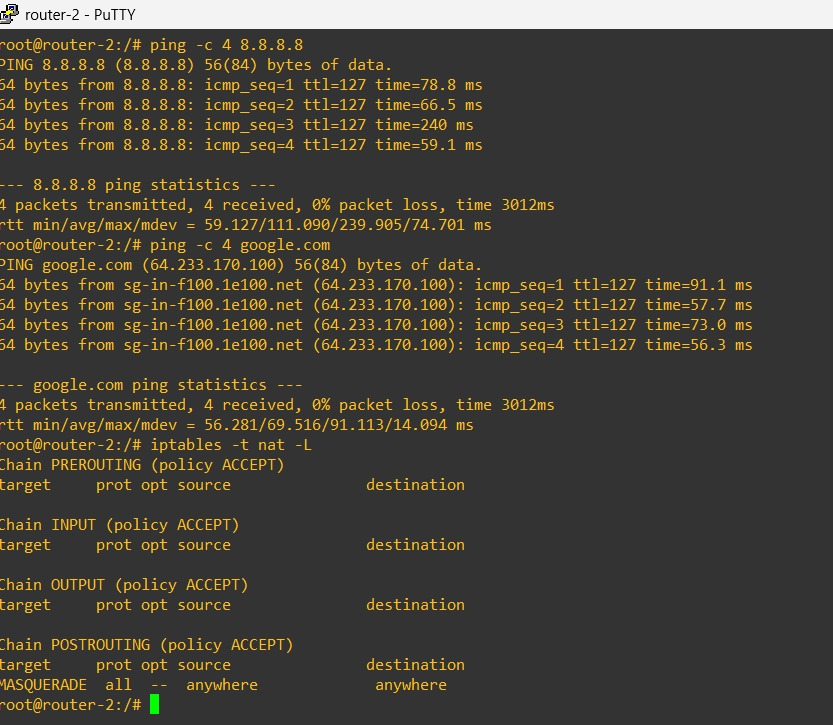

- **Explanation**

  Agar **Router-2** dapat terhubung ke internet dan berfungsi sebagai gateway bagi jaringan internal, dilakukan konfigurasi pada file `/etc/network/interfaces` (via Edit Config) dengan detail sebagai berikut:

  1.  **Koneksi Internet (DHCP & Default Route):**
      Interface `eth3` yang terhubung ke Cloud/NAT dikonfigurasi menggunakan **DHCP** (`iface eth3 inet dhcp`).
      * Hal ini membuat Router-2 otomatis mendapatkan IP Address Publik/WAN.
      * Secara otomatis mendapatkan **Default Gateway** (Static Route `0.0.0.0/0`) yang mengarah ke internet, sehingga memenuhi syarat routing pada soal.
      * DNS Server diset ke Google (`8.8.8.8`) agar router bisa mengenali nama domain.

  2.  **IP Forwarding:**
      Perintah `up echo 1 > /proc/sys/net/ipv4/ip_forward` ditambahkan untuk mengaktifkan kemampuan router meneruskan paket data antar-interface.

  3.  **Otomatisasi Instalasi IPTables (Dependensi):**
      Dikarenakan *image* router yang digunakan minim fitur (tidak memiliki package `iptables` secara default), ditambahkan script `post-up` untuk melakukan instalasi otomatis saat booting:
      ```bash
      post-up apt-get update -qq
      post-up DEBIAN_FRONTEND=noninteractive apt-get install iptables -y -qq
      ```
      Ini memastikan fitur NAT bisa berjalan tanpa perlu instalasi manual setiap kali restart.

  4.  **Konfigurasi NAT (Network Address Translation):**
      Setelah `iptables` terinstall, router menjalankan perintah Masquerade:
      ```bash
      iptables -t nat -A POSTROUTING -o eth3 -j MASQUERADE
      ```
      Konfigurasi ini memungkinkan IP Private dari jaringan internal "meminjam" IP `eth3` saat mengakses internet.

  **Konfigurasi Lengkap:**
  ```bash
  # Interface ke Router Tetangga (Static)
  auto eth0
  iface eth0 inet static
      address 10.68.2.242
      netmask 255.255.255.252
      up echo 1 > /proc/sys/net/ipv4/ip_forward

  auto eth1
  iface eth1 inet static
      address 10.68.2.249
      netmask 255.255.255.252

  auto eth2
  iface eth2 inet static
      address 10.68.2.245
      netmask 255.255.255.252

  # Interface ke Internet (DHCP + NAT Script)
  auto eth3
  iface eth3 inet dhcp
      up echo nameserver 8.8.8.8 > /etc/resolv.conf
      post-up apt-get update -qq
      post-up DEBIAN_FRONTEND=noninteractive apt-get install iptables -y -qq
      post-up iptables -t nat -A POSTROUTING -o eth3 -j MASQUERADE

## Soal 3

> Setelah mengimplementasi subnetting, buatlah agar seluruh topologi dapat terhubung. Lakukan Dynamic Routing pada topologi tersebut. *Pastikan seluruh node yang ada dapat mengakses internet*.

> _After implementing subnetting, ensure the entire topology is connected. Perform Dynamic Routing on the topology. *Ensure that all nodes can access the internet*._

**Answer:**

- **Screenshot**

  **1. Tes Koneksi Client IT-PC-1 Ping 8.8.8.8, Ping ke Router-1, dan PING ke google.com:**
  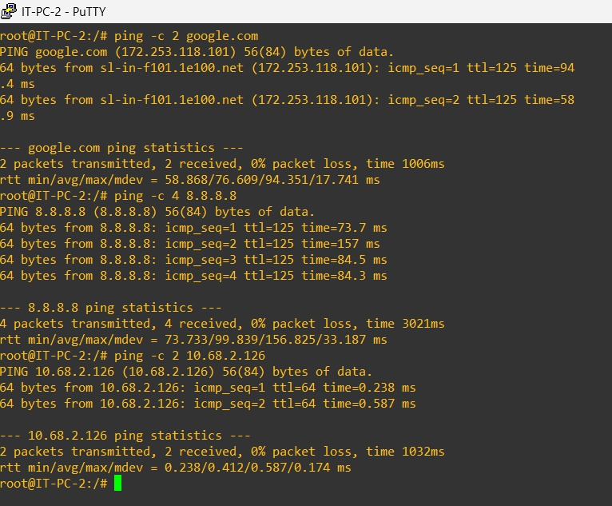

  **2. Tabel Routing OSPF pada Router-4 misalnya:**
  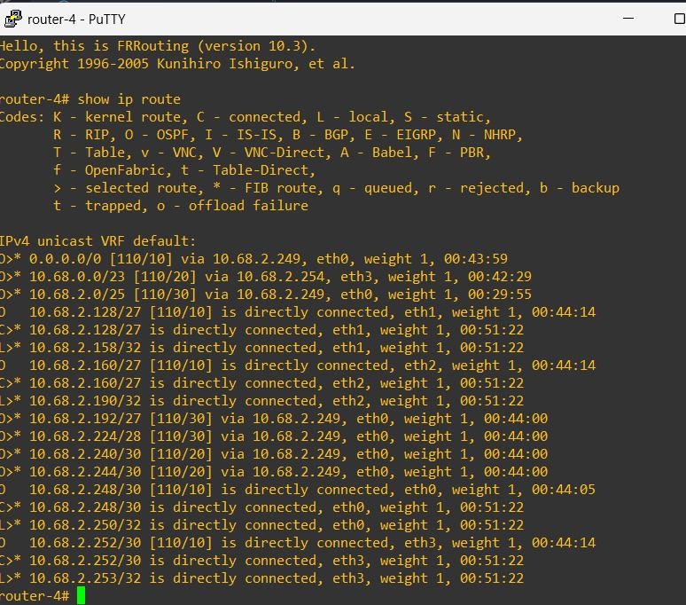

- **Explanation**

  Untuk menghubungkan seluruh node dalam topologi dan mendistribusikan jalur internet, digunakan protokol **Dynamic Routing OSPF** (Open Shortest Path First) menggunakan suite **FRRouting (FRR)**.

  Langkah-langkah konfigurasi yang dilakukan:
  1.  **Mengaktifkan OSPF (Router-2 / Gateway):**
      Router-2 dikonfigurasi sebagai *AS Boundary Router*. Ia meng-advertise network lokal `10.68.0.0/16` ke area 0 dan menyebarkan *Default Route* ke router tetangga menggunakan perintah `default-information originate`.

  2.  **Mengaktifkan OSPF (Router-1, R3, R4, R5):**
      Router cabang mengaktifkan OSPF untuk network `10.68.0.0/16` area 0. Hal ini membuat mereka otomatis mempelajari rute menuju subnet lain dan rute menuju internet (via Router-2).

  3.  **Verifikasi:**
      * Tabel routing (`ip route`) pada router cabang menunjukkan adanya rute yang didapat via protokol dinamis (OSPF/Zebra).
      * Client (PC/Server) pada subnet terdalam berhasil melakukan ping ke `8.8.8.8` (Google), membuktikan bahwa Routing dan NAT telah berjalan sempurna dari ujung ke ujung.

  **Konfigurasi Script (Edit Config) untuk Autostart OSPF:**
  ```bash
  # Script ini ditambahkan pada setiap router untuk menjalankan FRR saat booting
  post-up /usr/lib/frr/zebra -d
  post-up /usr/lib/frr/ospfd -d
  post-up /usr/lib/frr/mgmtd -d
  post-up sleep 5
  # Inject Config OSPF via vtysh (R1, R3, R4, R5)
  post-up vtysh -c "conf t" -c "router ospf" -c "network 10.68.0.0/16 area 0" -c "end" -c "write"

## Soal 4

> Lakukan setup web server dengan file html di attachment berikut: [ Attachment ](https://drive.google.com/file/d/199qwfTNJCkxDV7mdO-MsaDdApkmKsnAG/view?usp=sharing)  menggunakan nginx pada “Web-Server-1” dan “Web-Server-2”.  
*Config dibebaskan kepada praktikkan dengan catatan menggunakan port 80*.

> _Set up a web server with the HTML file in the following attachment: [ Attachment ](https://drive.google.com/file/d/199qwfTNJCkxDV7mdO-MsaDdApkmKsnAG/view?usp=sharing) using nginx on “Web-Server-1” and “Web-Server-2”._
_Configuration is free to practice, but note that it uses port 80._

**Answer:**

- **Screenshot**

  **Tes Akses Web Server (Curl):**
  

- **Explanation**

  Instalasi dan konfigurasi Web Server dilakukan secara otomatis menggunakan script pada `/etc/network/interfaces` (Edit Config) di kedua node (**Web-Server-1** dan **Web-Server-2**).

  Langkah-langkah yang dilakukan oleh script tersebut adalah:
  1.  **Update & Install:** Melakukan `apt-get update` dan instalasi `nginx` secara *silent* (non-interactive) agar tidak mengganggu proses booting.
  2.  **Clean Up:** Menghapus file default nginx (`index.nginx-debian.html`) agar tidak terjadi konflik tampilan.
  3.  **Deploy HTML:** Membuat file `index.html` baru di direktori `/var/www/html/` dengan isi konten HTML sesuai lampiran soal (menggunakan perintah `echo` dan redirection).
  4.  **Restart Service:** Menjalankan `service nginx restart` untuk menerapkan perubahan.
  5.  **Verifikasi:** Web server berjalan pada port 80 (default HTTP) dan dapat diakses oleh client lain dalam topologi, dibuktikan dengan hasil command `curl` yang menampilkan source code HTML yang telah diinjeksi.

  **Script Konfigurasi (Web-Server-1):**
  ```bash
  auto eth0
  iface eth0 inet static
      address 10.68.2.129
      netmask 255.255.255.224
      gateway 10.68.2.158
      up echo nameserver 8.8.8.8 > /etc/resolv.conf

      # Otomatisasi Install & Deploy HTML
      post-up apt-get update -qq
      post-up DEBIAN_FRONTEND=noninteractive apt-get install nginx -y -qq
      post-up rm -f /var/www/html/index.nginx-debian.html
      post-up echo '<!DOCTYPE html><html lang="en">... (Konten HTML Soal) ...</html>' > /var/www/html/index.html
      post-up service nginx restart

## Soal 5

> Kalian diminta untuk melakukan drop semua paket TCP yang masuk ke subnet HR dengan port 1337 dan 4444. Lakukan testing dengan netcat.

> _You are asked to drop all incoming TCP packets to the HR subnet with ports 1337 and 4444. Test with netcat._

**Answer:**

- **Screenshot**

  **Testing Drop Packet dengan Netcat:**
  *(Kiri: IT-PC-1 mencoba connect dan Gagal/Timeout. Kanan: HR-PC-1 Listening tapi tidak menerima apa-apa)*
  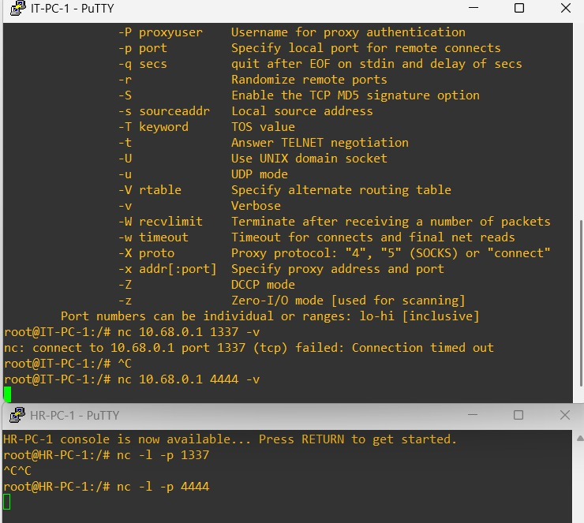

- **Explanation**

  Untuk memenuhi kebutuhan keamanan ini, konfigurasi dilakukan pada **Router-5 (Gateway HR LAN)** menggunakan `iptables`. Tujuannya adalah memfilter paket yang masuk menuju subnet HR (`10.68.0.0/23`).

  Langkah-langkah implementasi:

  1.  **Konfigurasi Firewall (Router-5):**
      Menambahkan aturan pada chain `FORWARD` untuk membuang (DROP) paket TCP yang menuju destinasi subnet HR dengan spesifik port 1337 dan 4444.
      Script berikut ditambahkan pada `Edit Config` Router-5:
      ```bash
      # Install IPTables (Jika belum ada)
      post-up sleep 20
      post-up apt-get update -qq && DEBIAN_FRONTEND=noninteractive apt-get install iptables -y -qq

      # Rule: DROP paket TCP ke HR Subnet (Port 1337 & 4444)
      post-up iptables -A FORWARD -p tcp -d 10.68.0.0/23 --dport 1337 -j DROP
      post-up iptables -A FORWARD -p tcp -d 10.68.0.0/23 --dport 4444 -j DROP
      ```

  2.  **Persiapan Testing Tools:**
      Menginstall `netcat-openbsd` pada node client (HR-PC-1 dan IT-PC-1) untuk simulasi koneksi TCP.

  3.  **Pengujian (Testing Evidence):**
      Seperti terlihat pada screenshot:
      * **Sisi Korban (HR-PC-1):** Membuka port (`nc -l -p 1337`) untuk menunggu koneksi.
      * **Sisi Penyerang (IT-PC-1):** Mencoba melakukan koneksi ke IP HR-PC-1 (`nc 10.68.0.1 1337 -v`).
      * **Hasil:** Koneksi pada IT-PC-1 mengalami **Time Out** atau **Stuck** (tidak ada respon `Succeeded!`), dan di sisi HR-PC-1 tidak muncul notifikasi koneksi masuk.
      
      Hal ini membuktikan bahwa paket TCP dari luar (IT LAN) menuju HR LAN pada port tersebut berhasil di-**DROP** oleh Router-5 sebelum sampai ke tujuan.

## Soal 6

> Lakukan pembatasan sehingga koneksi SSH pada semua Web Server hanya dapat dilakukan oleh user yang berada pada node IT-PC-1, IT-PC-2, dan IT-PC-3.

> _Implement restrictions so that SSH connections to all Web Servers can only be made by users on nodes IT-PC-1, IT-PC-2, and IT-PC-3._

**Answer:**

- **Screenshot**

  **Testing SSH Access:**
  *(Atas: IT-PC-1 berhasil connect/diminta password. Bawah: HR-PC-1 stuck/timeout karena ditolak)*
  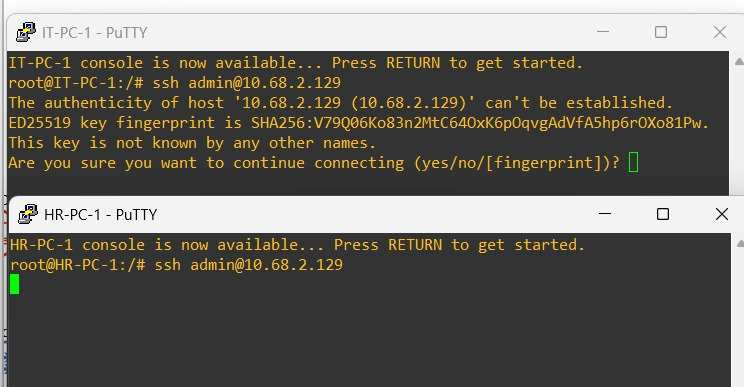

- **Explanation**

  Pembatasan akses Remote Server (SSH) dilakukan dengan menerapkan firewall pada **Web-Server-1** dan **Web-Server-2** menggunakan `iptables`. Strategi yang digunakan adalah *Whitelisting* pada chain `INPUT` (karena paket ditujukan ke server itu sendiri).

  Langkah-langkah implementasi:

  1.  **Instalasi Service:**
      Menginstall `openssh-server` pada Web Server agar layanan SSH aktif, dan `openssh-client` pada PC untuk melakukan testing.

  2.  **Konfigurasi Rules IPTables (Pada Web Server):**
      Urutan rules sangat penting dalam konfigurasi ini:
      * **Rule 1-3 (ACCEPT):** Mengizinkan paket TCP port 22 yang berasal dari source IP **IT-PC-1** (`10.68.2.1`), **IT-PC-2** (`10.68.2.2`), dan **IT-PC-3** (`10.68.2.3`).
      * **Rule 4 (DROP):** Memblokir semua paket TCP port 22 dari source IP manapun (0.0.0.0/0). Karena diletakkan di paling bawah, aturan ini menjadi "tembok" bagi IP yang tidak terdaftar di atas.

  3.  **Script Konfigurasi (Edit Config):**
      ```bash
      # Install OpenSSH Server & IPTables
      post-up apt-get update -qq
      post-up DEBIAN_FRONTEND=noninteractive apt-get install openssh-server iptables -y -qq
      post-up service ssh start

      # ALLOW Specific IT IPs (Whitelisting)
      post-up iptables -A INPUT -p tcp -s 10.68.2.1 --dport 22 -j ACCEPT
      post-up iptables -A INPUT -p tcp -s 10.68.2.2 --dport 22 -j ACCEPT
      post-up iptables -A INPUT -p tcp -s 10.68.2.3 --dport 22 -j ACCEPT

      # DROP All other SSH connection attempt
      post-up iptables -A INPUT -p tcp --dport 22 -j DROP
      ```

  4.  **Hasil Pengujian:**
      Seperti terlihat pada screenshot:
      * **IT-PC-1 (Authorized):** Berhasil terhubung ke server (muncul prompt password/confirmation), menandakan paket `ACCEPT`.
      * **HR-PC-1 (Unauthorized):** Mengalami *Connection Timed Out* saat mencoba SSH, menandakan paket di-`DROP` oleh firewall server.

## Soal 7

> Semua subnet hanya dapat mengakses semua DB-Server pada port 80 dan 443 (DB-Server-1 dan DB-Server-2) pada hari Senin-Sabtu, pukul 07:00- 22:00.

> _All subnets can only access all DB-Servers on ports 80 and 443 (DB-Server-1 and DB-Server-2) on Monday-Saturday, 07:00-22:00._

**Answer:**

- **Screenshot**

  **1. Testing IN-TIME (Berhasil):**
  *(Akses Port 80 pada jam kerja 08:00 -> Succeeded)*

  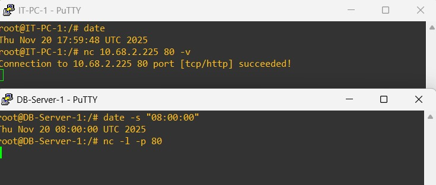

  **2. Testing OUT-OF-TIME (Gagal):**
  *(Akses Port 80 diluar jam kerja 23:00 -> Connection Timed Out)*

  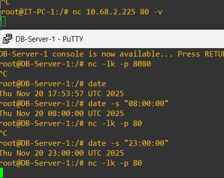

  **3. Testing WRONG PORT (Gagal):**
  *(Akses Port 8080 pada jam kerja -> Connection Timed Out)*

  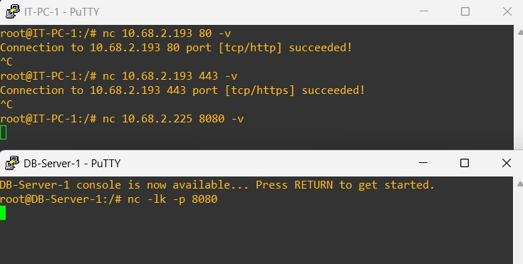

- **Explanation**

  Pembatasan akses berbasis waktu (*Time-Based Firewall*) diterapkan pada **DB-Server-1** dan **DB-Server-2** menggunakan modul `iptables` (`-m time`). Konfigurasi ini memastikan server hanya menerima koneksi pada jam kerja yang ditentukan.

  Langkah-langkah implementasi:

  1.  **Konfigurasi IPTables (Pada DB Server):**
      Script berikut ditambahkan pada `Edit Config` untuk dijalankan setiap booting:
      * **Rule ACCEPT:** Mengizinkan paket TCP masuk ke port 80 dan 443 HANYA JIKA waktu server menunjukkan pukul 07:00 s.d. 22:00 pada hari Senin-Sabtu.
      * **Rule DROP:** Membuang semua paket TCP lainnya (default deny). Ini akan memblokir akses di luar jam kerja ATAU akses ke port selain 80/443 (misal port 8080).

      ```bash
      # Install IPTables & Netcat
      post-up apt-get update -qq
      post-up DEBIAN_FRONTEND=noninteractive apt-get install iptables netcat-openbsd -y -qq

      # Rule: IZINKAN Port 80,443 pada Senin-Sabtu, 07:00-22:00
      post-up iptables -A INPUT -p tcp -m multiport --dports 80,443 -m time --timestart 07:00 --timestop 22:00 --weekdays Mon,Tue,Wed,Thu,Fri,Sat -j ACCEPT

      # Rule: BLOKIR sisanya (Luar jam kerja atau Port lain)
      post-up iptables -A INPUT -p tcp -j DROP
      ```

  2.  **Metode Pengujian (Testing):**
      Karena waktu berjalan real-time, pengujian dilakukan dengan memanipulasi jam sistem server menggunakan perintah `date -s` dan tool `netcat` (`nc`):
      * **Skenario A (In-Time):** Jam server diset ke `08:00`. Koneksi `nc` dari client ke port 80 berhasil (**Succeeded**).
      * **Skenario B (Out-of-Time):** Jam server diset ke `23:00` (Malam). Koneksi `nc` dari client mengalami **Time Out**.
      * **Skenario C (Wrong Port):** Jam server diset ke Jam Kerja, namun koneksi diarahkan ke port `8080`. Hasilnya tetap **Time Out** karena port tersebut tidak di-whitelist.

## Soal 8

> Kemudian, buat agar “Web-Server-1” dan “Web-Server-2” hanya memperbolehkan traffic bertipe HTTP.

> _Then, make sure that “Web-Server-1” and “Web-Server-2” only allow HTTP type traffic._

**Answer:**

- **Screenshot**

  **Testing Firewall HTTP Only:**
  *(Atas: Curl HTTP ke port 80 Berhasil. Bawah: SSH dan Netcat ke port lain Gagal/Timeout)*
  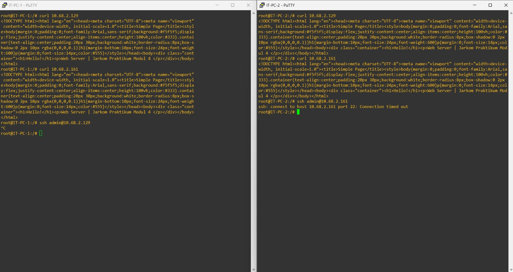

- **Explanation**

  Untuk memenuhi kebutuhan keamanan yang ketat (*Strict HTTP Only*), konfigurasi firewall diterapkan pada **Web-Server-1** dan **Web-Server-2**. Kebijakan ini akan menutup semua akses TCP (termasuk SSH yang sebelumnya dibuka) dan hanya menyisakan celah untuk layanan Web (Port 80).

  Langkah-langkah implementasi:

  1.  **Konfigurasi IPTables (Edit Config):**
      Script berikut ditambahkan di bagian akhir konfigurasi interface kedua Web Server:
      * **Rule 1 (ACCEPT HTTP):** Mengizinkan paket TCP yang menuju destination port 80 (`--dport 80`).
      * **Rule 2 (DROP ALL):** Membuang semua paket TCP sisanya. Urutan ini penting; jika paket bukan port 80, maka akan langsung terkena aturan DROP ini.

      ```bash
      # --- SOAL 8: FIREWALL HTTP ONLY ---
      post-up iptables -A INPUT -p tcp --dport 80 -j ACCEPT
      post-up iptables -A INPUT -p tcp -j DROP
      ```

  2.  **Verifikasi (Testing Evidence):**
      Pengujian dilakukan dari node client (IT-PC-1) dengan tiga skenario untuk memastikan firewall bekerja sempurna:
      * **Tes HTTP (Curl):** `curl 10.68.2.129` $\rightarrow$ **Berhasil/Reply**. Muncul kode HTML halaman web, menandakan Port 80 diizinkan. 

      * **Tes SSH (Login):** `ssh admin@10.68.2.129` $\rightarrow$ **Time Out**. Menandakan akses remote yang sebelumnya ada kini sudah diblokir.
      * **Tes Port Lain (Netcat):** `nc 10.68.2.129 8080` $\rightarrow$ **Time Out**. Menandakan port acak juga tertutup rapat.

## Soal 9

> Pilih salah satu Subnet dan lakukan blokir terhadap semua request protokol ICMP (ping) dari luar subnet terhadap subnet tersebut.

> _Select one of the Subnets and block all ICMP protocol requests (ping) from outside the subnet to that subnet._

**Answer:**

- **Screenshot**

  **Testing Blokir Ping (ICMP Drop):**
  *(HR-PC-1 sebagai "Orang Luar" mencoba ping ke IT-PC-1 namun Gagal/Timeout, membuktikan blokir ICMP berhasil)*
  

- **Explanation**

  Pada skenario ini, subnet yang dipilih untuk diamankan adalah **IT LAN (10.68.2.0/25)** yang berada di belakang **Router-1**. Konfigurasi firewall dilakukan untuk menolak semua paket ICMP (Ping) yang masuk dari interface luar (`eth1`) menuju subnet tersebut.

  Langkah-langkah implementasi:

  1.  **Strategi Konfigurasi (Anti-Stuck Optimization):**
      Karena instalasi `iptables` membutuhkan waktu dan koneksi internet yang stabil saat booting, script konfigurasi dijalankan di **Background** menggunakan perintah `sh -c "..." &`.
      * Hal ini mencegah proses booting router menjadi *stuck* (macet) saat menunggu download selesai.
      * Router dapat login segera, sementara proses instalasi dan penerapan rule berjalan diam-diam di latar belakang.

  2.  **Rule IPTables (Router-1):**
      Rule diterapkan pada chain `FORWARD` karena Router-1 bertindak sebagai gateway yang meneruskan paket.
      * **Rule:** `iptables -A FORWARD -p icmp -d 10.68.2.0/25 -i eth1 -j DROP`
      * **Penjelasan:** "Jika ada paket ICMP yang masuk dari interface `eth1` (dari arah Router-2/Luar) dengan tujuan subnet IT LAN, maka paket tersebut harus dibuang (DROP)."

  3.  **Script Konfigurasi Lengkap (Edit Config Router-1):**
      ```bash
      # --- Config Router-1 (IT Gateway) ---
      # (Konfigurasi Interface & OSPF Standard...)

      # --- SOAL 9: BLOKIR PING (BACKGROUND MODE) ---
      # Menjalankan instalasi dan firewall di background agar booting tidak blocking/stuck
      # Sleep 30s memastikan OSPF sudah convergence sebelum apt-get berjalan
      post-up sh -c "sleep 30 && apt-get update -qq && DEBIAN_FRONTEND=noninteractive apt-get install iptables -y -qq && iptables -A FORWARD -p icmp -d 10.68.2.0/25 -i eth1 -j DROP" &
      ```

  4.  **Hasil Pengujian:**
      * **Dari Luar (HR-PC-1):** Mencoba melakukan `ping 10.68.2.1` (IT-PC-1). Hasilnya **Request Timed Out**, membuktikan firewall bekerja melindungi subnet IT.
      * **Dari Dalam (IT-PC-1):** Masih tetap bisa melakukan ping keluar (misal ke Google), karena aturan DROP hanya berlaku untuk paket yang *masuk* (Incoming).

## Soal 10

> Konfigurasikan fitur logging untuk melakukan log terhadap seluruh paket yang di-DROP pada lalu lintas setiap node.

> _Configure the logging feature to log all dropped packets on each node's traffic._

**Answer:**

- **Screenshot**

  **Bukti Logging Paket yang Di-DROP:**
  *(Kiri: Counter Logging Router-5 mencatat paket port 1337/4444. Kanan: Counter Logging Router-1 mencatat kenaikan paket Ping yang diblokir)*
  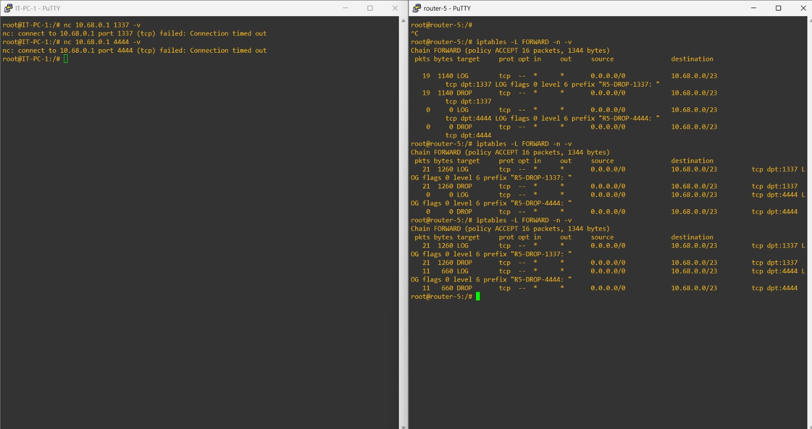

- **Explanation**

  Fitur Logging diaktifkan menggunakan target `-j LOG` pada `iptables`. Prinsip utamanya adalah menempatkan aturan LOG **tepat sebelum** aturan DROP. Dengan demikian, paket ilegal akan dicatat identitasnya ke dalam sistem log (kernel buffer) terlebih dahulu sebelum dimatikan.

  Implementasi dilakukan pada setiap node yang memiliki aturan DROP (Router-1, Router-5, Web Server, DB Server).

  1.  **Konfigurasi IPTables (Edit Config):**
      Setiap aturan DROP dimodifikasi dengan menambahkan baris LOG sebelumnya, lengkap dengan `--log-prefix` untuk memudahkan identifikasi.
      
      *Contoh pada Router-1 (Blokir Ping):*
      ```bash
      # 1. CATAT DULU (Log level 6 = Info)
      iptables -A FORWARD -p icmp -d 10.68.2.0/25 -i eth1 -j LOG --log-prefix 'R1-DROP-PING: ' --log-level 6
      # 2. BARU BUANG (Drop)
      iptables -A FORWARD -p icmp -d 10.68.2.0/25 -i eth1 -j DROP
      ```

      *Contoh pada Router-5 (Blokir Port 4444):*
      ```bash
      iptables -A FORWARD -p tcp ... --dport 4444 -j LOG --log-prefix "R5-DROP-4444: " --log-level 6
      iptables -A FORWARD -p tcp ... --dport 4444 -j DROP
      ```

  2.  **Analisis Bukti (Screenshot):**
      * **Router-5 (Kiri):** Terlihat pada tabel `iptables -nvL`, counter pada baris LOG dan DROP untuk port 4444 memiliki jumlah yang identik (naik dari 0 ke 11 paket). Ini membuktikan setiap paket serangan Netcat berhasil dicatat sebelum dibuang.
  
## Problems
kurang satu lagi fp alamak oi

## Revisions (if any)
