[](https://classroom.github.com/a/aRvIU2lf)
| Name                 | NRP        | Kelas |
|----------------------|------------|-------|
| Angela Vania Sugiyono | 5025241226 | A     |


## Put your topology config image here!

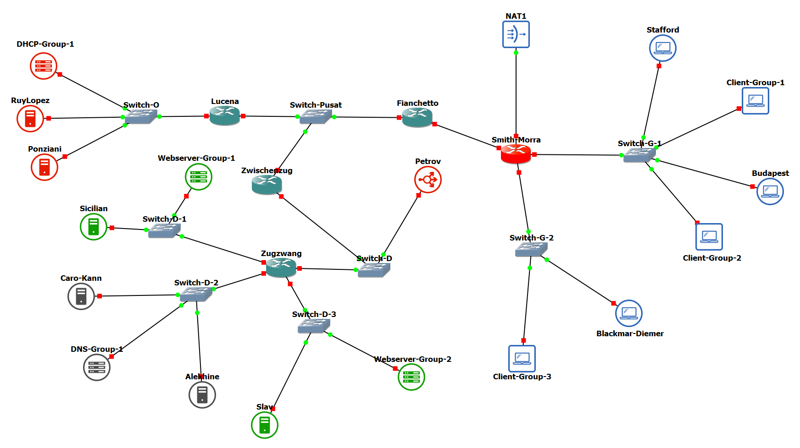

## Put your GNS3 Project file here!

[fpjarkom](fp226full.gns3project)

<br>

## Soal 1

> Menggunakan metode VLSM, buatlah pembagian subnet untuk masing-masing gedung dengan cara yang seefisien mungkin!

> _Using the VLSM method, create subnets for each building as efficiently as possible!_

**Answer:**

- **Screenshot**

  **1. Pengelompokan Node & Topologi:**
  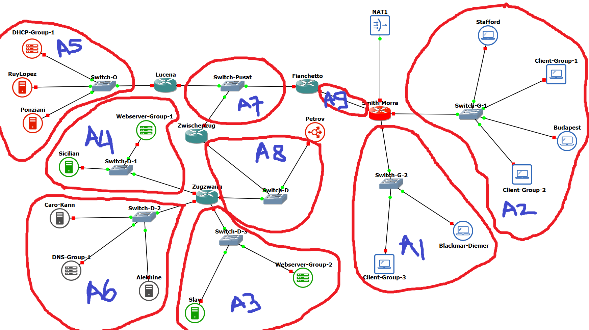

  **2. Diagram VLSM Tree:**
  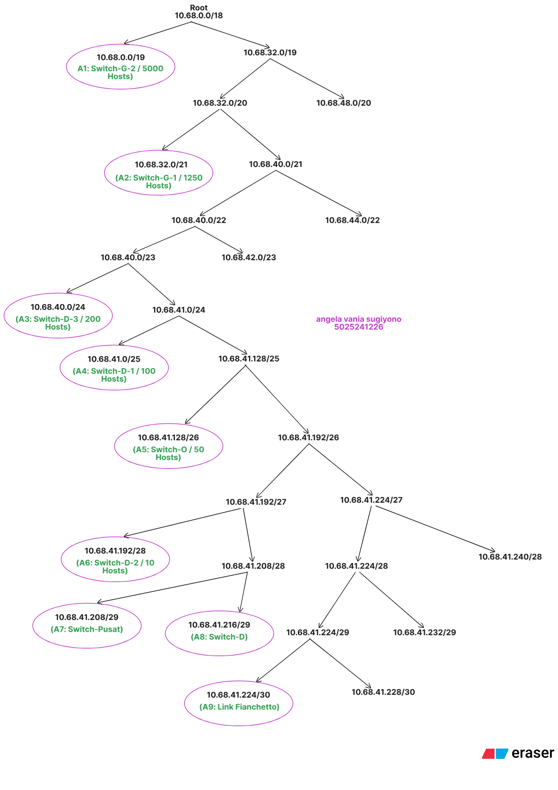

- **Explanation**

  Berikut adalah langkah-langkah pengerjaan subnetting menggunakan metode VLSM (*Variable Length Subnet Mask*) dengan prefix yang ditentukan `10.68.0.0`:

  1.  **Identifikasi & Grouping (Pengelompokan):**
      Langkah pertama adalah mengelompokkan *device* berdasarkan area switch dan kebutuhan host. Node "Group" pada topologi digunakan sebagai acuan jumlah host. Link yang mengarah ke internet (NAT1 pada Smith-Morra) tidak dihitung dalam VLSM ini karena menggunakan DHCP dari ISP/GNS3.
      * **A1 (Gedung G - Switch-G-2):** Mengakomodasi `Client-Group-3` dengan total kebutuhan 5000 Host.
      * **A2 (Gedung G - Switch-G-1):** Menggabungkan `Client-Group-1` (250 host) dan `Client-Group-2` (1000 host) karena berada dalam satu switch fisik yang sama, sehingga total kebutuhan menjadi 1250 Host.
      * **A3 - A6 (Server & DHCP):** Subnet untuk area server di Gedung D dan O.
      * **A7 - A9 (Inter-Router Link):** Subnet untuk koneksi antar router yang membutuhkan /29 (untuk >2 device) dan /30 (Point-to-Point).

  2.  **Sorting (Pengurutan):**
      Alokasi IP dilakukan urut dari kebutuhan host **terbesar ke terkecil** untuk mencegah *overlapping* IP Address:
      * Urutan: A1 (5000) $\rightarrow$ A2 (1250) $\rightarrow$ A3 (200) $\rightarrow$ ... $\rightarrow$ A9 (2).

  3.  **Subnetting & Tabel Alokasi:**
      Berikut adalah tabel pembagian IP Address secara lengkap:

| Label | Subnet / Area | Kebutuhan Host (Usable) | Netmask (CIDR) | Network ID | Broadcast Address | Range IP Usable |
| :---: | :--- | :---: | :---: | :---: | :---: | :---: |
| **A1** | Switch-G-2 (Client-Group-3) | 5000 | /19 | 10.68.0.0 | 10.68.31.255 | 10.68.0.1 - 10.68.31.254 |
| **A2** | Switch-G-1 (Client Gp 1 & 2) | 1250 | /21 | 10.68.32.0 | 10.68.39.255 | 10.68.32.1 - 10.68.39.254 |
| **A3** | Switch-D-3 (Webserver-Group-2) | 200 | /24 | 10.68.40.0 | 10.68.40.255 | 10.68.40.1 - 10.68.40.254 |
| **A4** | Switch-D-1 (Webserver-Group-1) | 100 | /25 | 10.68.41.0 | 10.68.41.127 | 10.68.41.1 - 10.68.41.126 |
| **A5** | Switch-O (DHCP-Group-1) | 50 | /26 | 10.68.41.128 | 10.68.41.191 | 10.68.41.129 - 10.68.41.190 |
| **A6** | Switch-D-2 (DNS-Group-1) | 10 | /28 | 10.68.41.192 | 10.68.41.207 | 10.68.41.193 - 10.68.41.206 |
| **A7** | Switch-Pusat Area (Router) | 3 | /29 | 10.68.41.208 | 10.68.41.215 | 10.68.41.209 - 10.68.41.214 |
| **A8** | Switch-D Area (Router/Node) | 3 | /29 | 10.68.41.216 | 10.68.41.223 | 10.68.41.217 - 10.68.41.222 |
| **A9** | Link Fianchetto - SmithMorra | 2 | /30 | 10.68.41.224 | 10.68.41.227 | 10.68.41.225 - 10.68.41.226 |

<br>

## Soal 2

> Konfigurasi semua router agar bisa terhubung ke semua jaringan. Gunakan static routing dan uji dengan melakukan ping dari **Budapest** ke **Alekhine** dan dari **Ponziani** ke **Sicilian**!

> _Configure all routers to connect to all networks. Use static routing and perform testing by pinging from **Budapest** to **Alekhine** and from **Ponziani** to **Sicilian**!_

**Answer:**

- **Screenshot**

  **Hasil Uji Konektivitas (Ping):**

  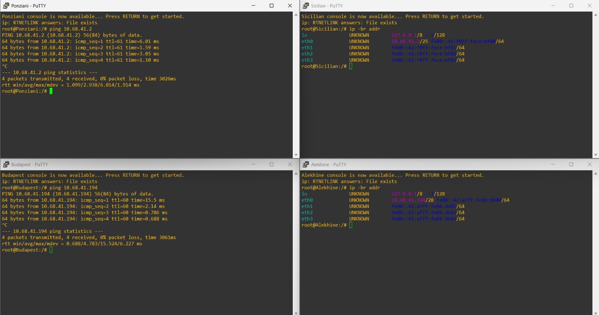

- **Explanation**

  Agar seluruh node dalam topologi dapat saling berkomunikasi, dilakukan konfigurasi IP Address, Gateway, dan Routing pada setiap perangkat. Berikut adalah rincian konfigurasi yang diterapkan pada file `/etc/network/interfaces`:

  ### 1. Konfigurasi Client (End-Device)
  Setiap client dikonfigurasi dengan IP Static dan Gateway yang mengarah ke interface router terdekat sesuai hasil perhitungan VLSM.

  * **Budapest (Gedung G - Client):**
      Menggunakan Gateway **Smith-Morra** (`10.68.32.1`).
      ```bash
      auto eth0
      iface eth0 inet static
          address 10.68.32.2
          netmask 255.255.248.0
          gateway 10.68.32.1
      ```

  * **Alekhine (Gedung D - DNS Slave):**
      Menggunakan Gateway **Zugzwang** (`10.68.41.193`).
      ```bash
      auto eth0
      iface eth0 inet static
          address 10.68.41.194
          netmask 255.255.255.240
          gateway 10.68.41.193
      ```

  * **Ponziani (Gedung O - DHCP Server):**
      Menggunakan Gateway **Lucena** (`10.68.41.129`).
      ```bash
      auto eth0
      iface eth0 inet static
          address 10.68.41.130
          netmask 255.255.255.192
          gateway 10.68.41.129
      ```

  * **Sicilian (Gedung D - Web Server):**
      Menggunakan Gateway **Zugzwang** (`10.68.41.1`).
      ```bash
      auto eth0
      iface eth0 inet static
          address 10.68.41.2
          netmask 255.255.255.128
          gateway 10.68.41.1
      ```

  ### 2. Konfigurasi Router (Static Routing)
  Pada setiap router, fitur **IP Forwarding** diaktifkan (`up echo 1 > /proc/sys/net/ipv4/ip_forward`) agar paket dapat diteruskan. Routing statis ditambahkan untuk mengenalkan subnet jaringan lain.

  * **Router Smith-Morra (Gateway Utama):**
      Mengatur koneksi internet (NAT) pada `eth0` dan routing ke gedung lain via **Fianchetto**.
      ```bash

      auto lo
      iface lo inet loopback

      up echo 1 > /proc/sys/net/ipv4/ip_forward

      # --- INTERNET & FIREWALL SCRIPT (eth0) ---
      auto eth0
      iface eth0 inet dhcp
          up echo nameserver 8.8.8.8 > /etc/resolv.conf

          post-up apt-get update -qq
          post-up DEBIAN_FRONTEND=noninteractive apt-get install iptables -y -qq

          post-up iptables -t nat -A POSTROUTING -o eth0 -j MASQUERADE

      # --- KE ARAH FIANCHETTO (A9) ---
      auto eth1
      iface eth1 inet static
          address 10.68.41.226
          netmask 255.255.255.252
          # Routing ke Gedung O & D (lewat Fianchetto)
          up ip route add 10.68.40.0/24 via 10.68.41.225
          up ip route add 10.68.41.0/25 via 10.68.41.225
          up ip route add 10.68.41.128/26 via 10.68.41.225
          up ip route add 10.68.41.192/28 via 10.68.41.225
          up ip route add 10.68.41.208/29 via 10.68.41.225
          up ip route add 10.68.41.216/29 via 10.68.41.225

      # --- KE ARAH CLIENT GROUP 1 & 2 (A2) ---
      auto eth2
      iface eth2 inet static
          address 10.68.32.1
          netmask 255.255.248.0

      # --- KE ARAH CLIENT GROUP 3 (A1) ---
      auto eth3
      iface eth3 inet static
          address 10.68.0.1
          netmask 255.255.224.0
      ```

  * **Router Fianchetto (Distribusi):**
      Penghubung antara Smith-Morra dan Switch-Pusat.
      ```bash

      auto lo
      iface lo inet loopback

      auto eth0
      iface eth0 inet static
        address 10.68.41.210
        netmask 255.255.255.248
        # Routing ke Gedung O (Via Lucena)
        up ip route add 10.68.41.128/26 via 10.68.41.209
        # Routing ke Gedung D (Via Zwischenzug)
        up ip route add 10.68.40.0/24 via 10.68.41.211
        up ip route add 10.68.41.0/25 via 10.68.41.211
        up ip route add 10.68.41.192/28 via 10.68.41.211
        up ip route add 10.68.41.216/29 via 10.68.41.211

      auto eth1
      iface eth1 inet static
        address 10.68.41.225
        netmask 255.255.255.252
        # Routing ke dalam Gedung G (Via Smith-Morra)
        up ip route add 10.68.0.0/19 via 10.68.41.226
        up ip route add 10.68.32.0/21 via 10.68.41.226
      ```

  * **Router Zwischenzug (Gedung D):**
      Gerbang masuk area server.
      ```bash
      auto lo
      iface lo inet loopback

      auto eth0
      iface eth0 inet static
        address 10.68.41.211
        netmask 255.255.255.248
        # Routing ke Gedung O (Via Lucena)
        up ip route add 10.68.41.128/26 via 10.68.41.209
        # Routing ke Gedung G (Via Fianchetto)
        up ip route add 10.68.0.0/19 via 10.68.41.210
        up ip route add 10.68.32.0/21 via 10.68.41.210
        up ip route add 10.68.41.224/30 via 10.68.41.210

      auto eth1
      iface eth1 inet static
        address 10.68.41.217
        netmask 255.255.255.248
        # Routing ke Internal Gedung D (Via Zugzwang)
        up ip route add 10.68.40.0/24 via 10.68.41.218
        up ip route add 10.68.41.0/25 via 10.68.41.218
        up ip route add 10.68.41.192/28 via 10.68.41.218
      ```

  * **Router Lucena (Gedung O):**
      Gateway untuk DHCP Server.
      ```bash
      auto lo
      iface lo inet loopback

      auto eth0
      iface eth0 inet static
        address 10.68.41.129
        netmask 255.255.255.192

      auto eth1
      iface eth1 inet static
        address 10.68.41.209
        netmask 255.255.255.248
        # Routing Static ke Gedung G (Via Fianchetto)
        up ip route add 10.68.0.0/19 via 10.68.41.210
        up ip route add 10.68.32.0/21 via 10.68.41.210
        up ip route add 10.68.41.224/30 via 10.68.41.210
        # Routing Static ke Gedung D (Via Zwischenzug)
        up ip route add 10.68.40.0/24 via 10.68.41.211
        up ip route add 10.68.41.0/25 via 10.68.41.211
        up ip route add 10.68.41.192/28 via 10.68.41.211
        up ip route add 10.68.41.216/29 via 10.68.41.211

      ```

  * **Router Zugzwang (Server Room):**
      Router terdalam yang terhubung langsung ke server.
      ```bash

      auto lo
      iface lo inet loopback

      # Arah ke Router Zwischenzug
      auto eth0
      iface eth0 inet static
        address 10.68.41.218
        netmask 255.255.255.248
        # Default Route keluar
        up ip route add 0.0.0.0/0 via 10.68.41.217

      # Arah ke Webserver-Group-1 (Sicilian)
      auto eth1
      iface eth1 inet static
        address 10.68.41.1
        netmask 255.255.255.128

      # Arah ke DNS-Group-1 (Caro-Kann)
      auto eth2
      iface eth2 inet static
        address 10.68.41.193
        netmask 255.255.255.240

      # Arah ke Webserver-Group-2 (Slav)
      auto eth3
      iface eth3 inet static
        address 10.68.40.1
        netmask 255.255.255.0
      ```
      
  ### 3.  Hasil Pengujian:
      Berdasarkan screenshot di atas, konfigurasi berhasil diverifikasi dengan:
      * **Budapest $\rightarrow$ Alekhine:** Sukses (*Reply*), membuktikan koneksi dari Gedung G ke Gedung D (melewati rute Smith-Morra $\rightarrow$ Fianchetto $\rightarrow$ Zwischenzug $\rightarrow$ Zugzwang).
      * **Ponziani $\rightarrow$ Sicilian:** Sukses (*Reply*), membuktikan koneksi dari Gedung O ke Gedung D (melewati rute Lucena $\rightarrow$ Zwischenzug $\rightarrow$ Zugzwang).

<br>

## Soal 3

> Berikan seluruh client (**Blackmar-Diemer, Budapest,** dan **Stafford**) IP secara dinamis dari DHCP. Range IP dibebaskan, namun tunjukkan bahwa mereka mendapatkan IP secara dinamis!

> _Assign all clients (**Blackmar-Diemer, Budapest,** and **Stafford**) dynamic IP addresses via DHCP. You may use any IP range you would like, but prove that they receive IP addresses dynamically!_

**Answer:**

- **Screenshot**

  **Hasil Cek IP (DHCP Lease):**
  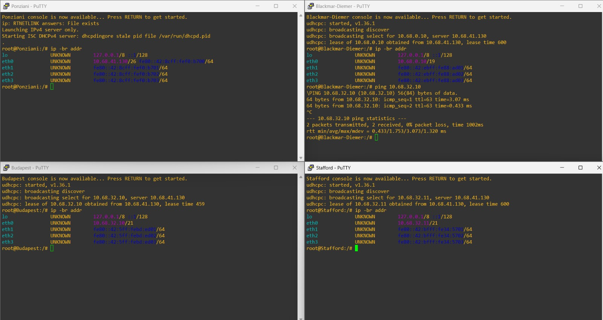

- **Explanation**

  Konfigurasi DHCP dilakukan agar Client di Gedung G mendapatkan IP otomatis dari Server di Gedung O. Berikut adalah langkah-langkah implementasinya:

  1.  **Konfigurasi DHCP Server (Node: Ponziani)**
      * Melakukan instalasi `isc-dhcp-server`.
      * Mengedit file `/etc/dhcp/dhcpd.conf` untuk mendeklarasikan subnet:
          * **Subnet A1 (10.68.0.0/19):** Range IP dinamis untuk *Blackmar-Diemer*.
          * **Subnet A2 (10.68.32.0/21):** Range IP dinamis untuk *Budapest* & *Stafford*.
          * **Global Options:** Menambahkan DNS Server (`10.68.41.193`, `8.8.8.8`) dan Domain Name (`parkov.com`).

  2.  **Konfigurasi DHCP Relay (Node: Smith-Morra)**
      * Karena berbeda segmen jaringan, router Smith-Morra difungsikan sebagai *Relay Agent* dengan menginstall `isc-dhcp-relay`.
      * Konfigurasi pada `/etc/default/isc-dhcp-relay`:
          * **SERVERS:** Diarahkan ke IP Ponziani (`10.68.41.130`).
          * **INTERFACES:** Mendengarkan request pada `eth2` & `eth3` (arah client) dan meneruskan lewat `eth1` (arah server).

  3.  **Checksum Fix (GNS3 Issue)**
      * Mengatasi *bug* GNS3 dimana paket DHCP sering dianggap *corrupt*.
      * Menambahkan aturan iptables pada Server dan Relay:
          `iptables -A POSTROUTING -t mangle -p udp --dport 67:68 -j CHECKSUM --checksum-fill`.

  4.  **Verifikasi Client**
      * Interface client diubah menjadi `iface eth0 inet dhcp` pada `/etc/network/interfaces`.
      * Hasil screenshot menunjukkan client berhasil mendapatkan IP, Gateway, dan DNS yang sesuai secara dinamis.

<br>

## Soal 4

> Berikan web server **Slav** dan **Sicilian** IP address yang tetap/fixed dari DHCP.

> _Assign **Slav** and **Sicilian** web servers fixed IP addresses via DHCP._

**Answer:**

- **Screenshot**
  
  **Hasil cek IP**:

  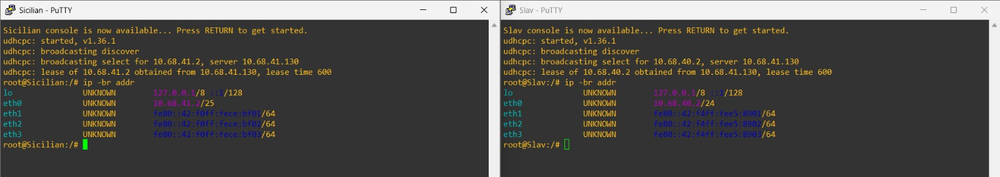

- **Explanation**

  Berikut adalah langkah-langkah konfigurasi untuk menerapkan *Fixed DHCP Lease*:

  1.  **Konfigurasi DHCP Server (Node: Ponziani)**
      Tambahkan konfigurasi subnet dan reservasi IP pada file `/etc/dhcp/dhcpd.conf`.

      * **Deklarasi Subnet:**
          Menambahkan subnet A3 dan A4 agar DHCP Server mengenali segmen jaringan tersebut.
          ```bash
          # === SUBNET A3 (Slav) ===
          subnet 10.68.40.0 netmask 255.255.255.0 {
              option routers 10.68.40.1;
              option subnet-mask 255.255.255.0;
              option broadcast-address 10.68.40.255;
          }

          # === SUBNET A4 (Sicilian) ===
          subnet 10.68.41.0 netmask 255.255.255.128 {
              option routers 10.68.41.1;
              option subnet-mask 255.255.255.128;
              option broadcast-address 10.68.41.127;
          }
          ```

      * **Deklarasi Fixed Address:**
          Menentukan IP tetap berdasarkan *hardware ethernet* (MAC Address) yang didapatkan melalui perintah `ip link`.
          ```bash
          # --- Slav ---
          host Slav {
              hardware ethernet 02:42:f4:e5:89:00;
              fixed-address 10.68.40.2;
          }

          # --- Sicilian ---
          host Sicilian {
              hardware ethernet 02:42:f0:ce:bf:00;
              fixed-address 10.68.41.2;
          }
          ```
      
      * **Restart Service:**
          `service isc-dhcp-server restart`

  2.  **Setup DHCP Relay (Node: Zugzwang)**
      Karena server berada di balik router, diperlukan konfigurasi relay pada gateway terdekat.

      * **Instalasi:**
          `apt-get update`
          `apt-get install -y isc-dhcp-relay iptables`

      * **Konfigurasi Relay:**
          Edit file `/etc/default/isc-dhcp-relay` untuk mengarahkan request ke IP DHCP Server (Ponziani).
          ```bash
          SERVERS="10.68.41.130"
          INTERFACES="eth0 eth1 eth3"
          OPTIONS=""
          ```

      * **Checksum Fix (GNS3):**
          Menambahkan rule iptables untuk memperbaiki paket UDP yang sering dianggap *corrupt* di GNS3.
          `iptables -A POSTROUTING -t mangle -p udp --dport 67:68 -j CHECKSUM --checksum-fill`

      * **Restart Service:**
          `service isc-dhcp-relay restart`

  3.  **Konfigurasi Client (Node: Slav & Sicilian)**
      Pada sisi client, konfigurasi IP statis dihapus dan diganti menjadi DHCP. Setting `hwaddress` ditambahkan agar MAC Address tidak berubah saat topologi di-restart, menjaga validitas *Fixed Address*.

      * **Slav :**
          ```bash
          auto eth0
          iface eth0 inet dhcp
          hwaddress ether 02:42:f4:e5:89:00
          ```

      * **Sicilian :**
          ```bash
          auto eth0
          iface eth0 inet dhcp
          hwaddress ether 02:42:f0:ce:bf:00
          ```

<br>


## Soal 5

> Buatlah konfigurasi untuk domain:
> **parkov.com** → IP Node **Slav**
> **paskarov.com** → IP Node **Sicilian**
> Pada **DNS Master Caro-Kann.** Tambahkan juga subdomain www untuk kedua domain tersebut.

> *Configure the domains:*
> **parkov.com** → **Slav** Node IP
> **paskarov.com** → **Sicilian** Node IP
> *On the **Caro-Kann DNS Master,** then add the www subdomain for both domains.*

**Answer:**

- **Screenshot**

  **Hasil ping:**
  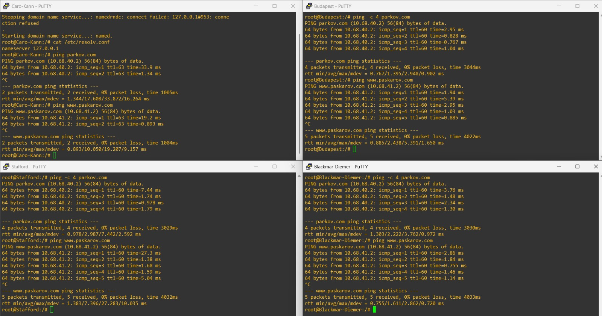

- **Explanation**

  Berikut adalah langkah-langkah konfigurasi DNS Master pada node **Caro-Kann**:

  1.  **Instalasi Bind9**
      Lakukan update dan instalasi paket DNS server:
      `apt-get update && apt-get install -y bind9`

  2.  **Konfigurasi Zone Domain**
      Edit file `/etc/bind/named.conf.local` untuk mendaftarkan dua zone domain baru (`parkov.com` dan `paskarov.com`):

      ```bash
      zone "parkov.com" {
          type master;
          file "/etc/bind/db.parkov";
      };

      zone "paskarov.com" {
          type master;
          file "/etc/bind/db.paskarov";
      };
      ```

  3.  **Konfigurasi Database Domain parkov.com**
      Buat file konfigurasi baru di `/etc/bind/db.parkov`. Arahkan root domain (`@`) dan subdomain `www` ke IP **Slav** (`10.68.40.2`):

      ```bash
      ; Domain parkov.com -> Slav
      $TTL    604800
      @       IN      SOA     parkov.com. root.parkov.com. (
                              2         ; Serial
                              604800    ; Refresh
                              86400     ; Retry
                              2419200   ; Expire
                              604800 )  ; Negative Cache TTL
      ;
      @       IN      NS      parkov.com.
      @       IN      A       10.68.40.2
      www     IN      A       10.68.40.2
      ```

  4.  **Konfigurasi Database Domain paskarov.com**
      Buat file konfigurasi baru di `/etc/bind/db.paskarov`. Arahkan root domain (`@`) dan subdomain `www` ke IP **Sicilian** (`10.68.41.2`):

      ```bash
      ; Domain paskarov.com -> Sicilian
      $TTL    604800
      @       IN      SOA     paskarov.com. root.paskarov.com. (
                              2         ; Serial
                              604800    ; Refresh
                              86400     ; Retry
                              2419200   ; Expire
                              604800 )  ; Negative Cache TTL
      ;
      @       IN      NS      paskarov.com.
      @       IN      A       10.68.41.2
      www     IN      A       10.68.41.2
      ```

  5.  **Finalisasi & Restart**
      * Arahkan DNS Server ke *localhost* pada `/etc/resolv.conf` agar perubahan terbaca oleh server itu sendiri:
          `nameserver 127.0.0.1`
      * Restart service bind9 untuk menerapkan konfigurasi:
          `service bind9 restart`

<br>

## Soal 6

> Konfigurasikan juga **Alekhine** sebagai **DNS Slave** yang bekerja untuk membantu **Caro-Kann.** Lakukan pengujian dengan **mematikan Caro-Kann** lalu coba ping ke domain dan subdomain tersebut (pilih salah satu saja).

> _Configure **Alekhine** as a **DNS Slave** to assist **Caro-Kann**. Perform testing by **disabling Caro-Kann** and then pinging the domain and subdomain (choose only one)._

**Answer:**

- **Screenshot**

  **Hasil Konfigurasi Slave & Pengujian Failover:**
  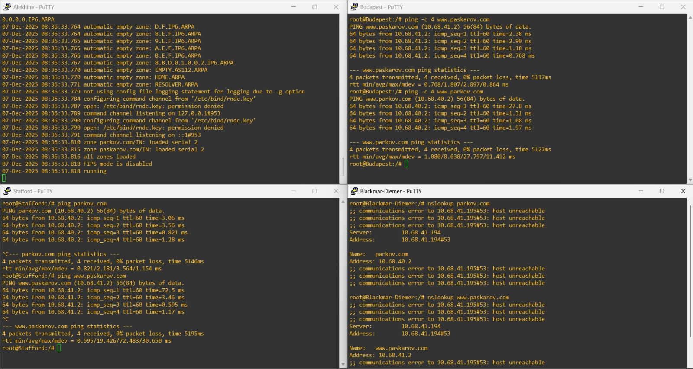

- **Explanation**

  Implementasi DNS Slave dilakukan untuk menjamin ketersediaan layanan (*Redundancy*) saat DNS Master mengalami gangguan. Berikut langkah konfigurasi dan analisis pengujiannya:

  1.  **Konfigurasi DNS Master (Caro-Kann)**
      Pada file `/etc/bind/named.conf.local`, ditambahkan opsi `allow-transfer` yang mengarah ke IP Alekhine agar izin transfer zona diberikan.

  2.  **Konfigurasi DNS Slave (Alekhine)**
      Pada node Alekhine, file `/etc/bind/named.conf.local` dikonfigurasi dengan tipe **slave**. Direktori penyimpanan cache diarahkan ke `/var/lib/bind/` agar memiliki izin tulis (*write permission*) untuk update otomatis dari Master.

      ```bash
      zone "parkov.com" {
          type slave;
          masters { 10.68.41.195; };  // IP Caro-Kann (Master)
          file "/var/lib/bind/db.parkov";
      };

      zone "paskarov.com" {
          type slave;
          masters { 10.68.41.195; };  // IP Caro-Kann (Master)
          file "/var/lib/bind/db.paskarov";
      };
      ```

  3.  **Konfigurasi Client (Resolver)**
      File `/etc/resolv.conf` pada client dikonfigurasi dengan dua *nameserver*: IP Master (`.195`) sebagai prioritas utama dan IP Slave (`.194`) sebagai cadangan.

  4.  **Analisis Pengujian (Failover Test)**
      Berdasarkan screenshot hasil pengujian di atas:
      * **Simulasi:** Service DNS pada Master (Caro-Kann) dimatikan.
      * **Log Nslookup (Blackmar-Diemer):** Terlihat pesan `communications error to 10.68.41.195#53: host unreachable`. Ini membuktikan client berusaha menghubungi Master namun gagal.
      * **Failover Sukses:** Baris berikutnya menunjukkan `Server: 10.68.41.194`. Client secara otomatis mengalihkan permintaan ke **Alekhine (Slave)**.
      * **Resolusi Berhasil:** Domain `parkov.com` berhasil diterjemahkan menjadi IP `10.68.40.2`, dan ping dari Budapest serta Stafford berjalan lancar (*Reply*).

<br>

## Soal 7

> Konfigurasikan **Sicilian** agar berfungsi sebagai **web server nginx** yang akan menyajikan [halaman berikut](https://drive.google.com/file/d/1eX0ZjRKprx8T34XFAssrpc7ZE1j6Jv0j/view). Konfigurasikan juga agar **Sicilian** bisa menyimpan custom access log ke file **/tmp/access.log** dan error log ke file **/tmp/error.log.**

> _Configure **Sicilian** to function as an **nginx web server**that will serve [this page](https://drive.google.com/file/d/1eX0ZjRKprx8T34XFAssrpc7ZE1j6Jv0j/view). Also, configure **Sicilian** to save custom access logs to **/tmp/access.log** and error logs to **/tmp/error.log.**_

**Answer:**

- **Screenshot**

  **Hasil Akses Halaman Web & Cek Log:**
  
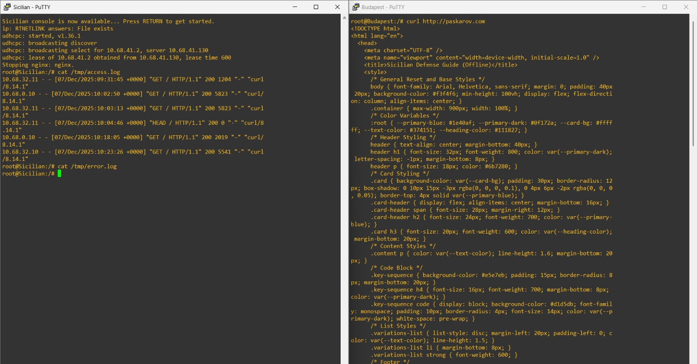

- **Explanation**

  Konfigurasi web server Nginx pada node **Sicilian** dilakukan secara otomatis melalui perintah `post-up` pada file `/etc/network/interfaces`. Hal ini memastikan server dan seluruh konfigurasinya berjalan setiap kali node dihidupkan.

  1.  **Persiapan Lingkungan dan Instalasi Nginx**
      * Node Sicilian dikonfigurasi menggunakan *Fixed DHCP Lease* (Soal 4) dan `hwaddress ether` untuk menjamin IP Address tetap (`10.68.41.2`).
      * Dilakukan instalasi paket **nginx** secara *non-interaktif*.
      * Dibuat struktur direktori kustom untuk file web (`/myscripts/myweb`) dan konfigurasi (`/myscripts/myconfig`).

  2.  **Pembuatan Konten HTML**
      * Halaman web "Sicilian Defense Guide" (`sicilian.html`) yang diminta soal dibuat secara presisi menggunakan perintah `echo` dan *redirection* (`>>`) ke direktori `/myscripts/myweb/`.

  3.  **Konfigurasi Log Kustom (Custom Log Path)**
      * File konfigurasi Nginx kustom dibuat di `/myscripts/myconfig/nginx.conf`.
      * Untuk memenuhi permintaan soal, direktif `access_log` dan `error_log` diarahkan ke direktori temporer `/tmp/`:

      ```nginx
      http {
          # SOAL 7: Menyimpan log ke direktori /tmp/
          access_log /tmp/access.log;
          error_log /tmp/error.log;
          
          server {
              listen 80;
              server_name paskarov.com;
              root /myscripts/myweb;
              index sicilian.html;
              # ...
          }
      }
      ```

  4.  **Eksekusi Nginx**
      * Setelah file konfigurasi dibuat, default service Nginx dihentikan (`service nginx stop`).
      * Nginx dijalankan menggunakan file konfigurasi kustom:
          `nginx -c /myscripts/myconfig/nginx.conf`

  5.  **Verifikasi**
      * Akses halaman web menggunakan domain `paskarov.com` atau IP `10.68.41.2` dari client lain.
      * Untuk memverifikasi log, perintah `cat /tmp/access.log` dijalankan di Sicilian untuk melihat entri akses dari client.

<br>

---

## Soal 8

> Buatlah custom access log ke file **/tmp/access.log.** Untuk keperluan logging, gunakan format log seperti di bawah:
>
> * Tanggal dan waktu akses dalam format standar log.
> * Nama node yang sedang diakses.
> * Alamat IP klien yang mengakses website.
> * Metode HTTP dan URI yang diakses oleh klien.
> * Status respons HTTP yang diberikan oleh server.
> * Jumlah byte yang dikirimkan dalam respons.
> * Waktu yang dihabiskan oleh server untuk menangani permintaan.
>
> **Contoh format log:**
> `[01/Oct/2024:11:30:45 +0000] Jarkom Node Sicilian Access from 192.168.1.15 using method "GET /resep/bayam HTTP/1.1" returned status 200 with 2567 bytes sent in 0.038 seconds`

> *Webserver: Create a custom access log to the file **/tmp/access.log.** For logging purposes, use the format below:*
>
> * *Date and time of access (standard log format).*
> * *Node name being accessed.*
> * *Client IP address.*
> * *HTTP method and URI accessed by the client.*
> * *HTTP response status.*
> * *Number of bytes sent.*
> * *Time spent processing the request.*
>
> *Example:*
> `[01/Oct/2024:11:30:45 +0000] Jarkom Node Sicilian Access from 192.168.1.15 using method "GET /resep/bayam HTTP/1.1" returned status 200 with 2567 bytes sent in 0.038 seconds`


**Answer**

- Screenshot

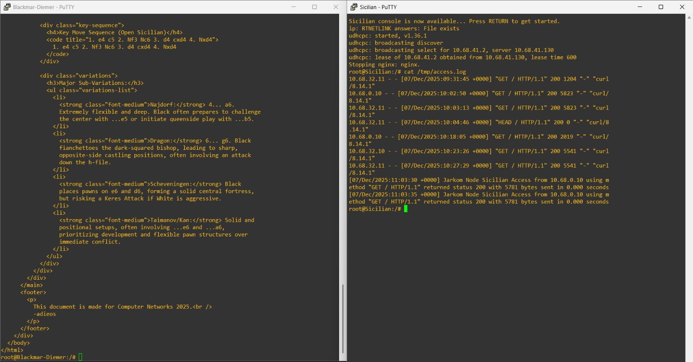

- Explanation

Untuk memenuhi permintaan *custom access log*, dilakukan penambahan direktif `log_format` pada konfigurasi Nginx di node **Sicilian**.

**1. Definisi Variabel Log Kustom**

Format log kustom menggunakan variabel Nginx berikut:

* **Tanggal & waktu:** `$time_local`
* **Alamat IP klien:** `$remote_addr`
* **HTTP method & URI:** `"$request"`
* **Status respons:** `$status`
* **Jumlah byte:** `$bytes_sent`
* **Waktu proses:** `$request_time`

Contoh format disusun agar sesuai dengan soal.

**2. Konfigurasi Nginx (`/myscripts/myconfig/nginx.conf`)**

Dua perubahan utama dilakukan:

1. Mendefinisikan `log_format` baru
2. Menerapkannya pada `access_log`

#### **Definisi Format Kustom**

```nginx
http {
    log_format jarkom_format '[$time_local] Jarkom Node Sicilian Access from $remote_addr using method "$request" returned status $status with $bytes_sent bytes sent in $request_time seconds';
    
    # ...
}
```

#### **Penerapan pada Access Log**

```nginx
server {
    # ...
    access_log /tmp/access.log jarkom_format;
}
```

**3. Script Konfigurasi Nginx (Post-Up)**

Script berikut mereset dan membangun ulang konfigurasi Nginx di node Sicilian:

```bash
# Buat Config NGINX Kustom (SOAL 8: Custom Log Format)

post-up echo 'user www-data;' > /myscripts/myconfig/nginx.conf
# ... (Konfigurasi Nginx Umum) ...
post-up echo 'events { worker_connections 768; }' >> /myscripts/myconfig/nginx.conf
post-up echo 'http {' >> /myscripts/myconfig/nginx.conf

# <<< DEFINISI FORMAT KUSTOM SOAL 8 >>>
post-up echo '    log_format jarkom_format '\''[$time_local] Jarkom Node Sicilian Access from $remote_addr using method "$request" returned status $status with $bytes_sent bytes sent in $request_time seconds'\'';' >> /myscripts/myconfig/nginx.conf

# LOG FILES
post-up echo '    error_log /tmp/error.log;' >> /myscripts/myconfig/nginx.conf

# ... (lanjutan konfigurasi server block) ...

# MENGGUNAKAN FORMAT KUSTOM SOAL 8 PADA ACCESS LOG
post-up echo '        access_log /tmp/access.log jarkom_format;' >> /myscripts/myconfig/nginx.conf

post-up echo '    }' >> /myscripts/myconfig/nginx.conf
post-up echo '}' >> /myscripts/myconfig/nginx.conf

# Start Nginx
post-up service nginx stop
post-up nginx -c /myscripts/myconfig/nginx.conf
```


Setelah node Sicilian direstart dan website diakses dari client, perintah berikut akan menampilkan log kustom:

```bash
cat /tmp/access.log
```

</br>

## Soal 9

> Konfigurasikan juga **Slav** agar berfungsi sebagai **web server nginx** yang menyajikan [halaman berikut](https://drive.google.com/file/d/1h8ik1Zcubntp0dvHt9NHYqSZLSTG6FuZ/view?usp=drive_link) dan **hanya** bisa diakses melalui port **8000** dan **8888.**

> _Configure **Slav** to function as an **nginx web server** that serves [this page](https://drive.google.com/file/d/1h8ik1Zcubntp0dvHt9NHYqSZLSTG6FuZ/view?usp=drive_link) and is **only** accessible via ports **8000** and **8888.**_

**Answer:**

- **Screenshot**

  **Hasil Uji Akses Port 8000 & 8888:**
  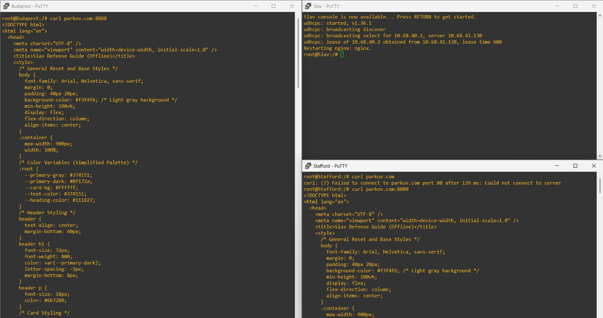

- **Explanation**

  Konfigurasi web server Nginx pada node **Slav** bertujuan untuk menyajikan konten dan membatasi akses hanya melalui port tertentu (8000 dan 8888).

  1.  **Instalasi & Konten:**
      * Node Slav dikonfigurasi menggunakan *Fixed DHCP Lease* (Soal 4) untuk mendapatkan IP `10.68.40.2`.
      * Konten halaman web "Slav Defense Guide" dibuat dan ditempatkan di direktori default Nginx (`/var/www/html/index.html`).

  2.  **Pembatasan Akses Port (Wajib):**
      * Pada file konfigurasi server block, direktif `listen` diubah untuk menghapus port `80` dan hanya menyertakan port yang diminta. Hal ini menjamin pembatasan akses port sesuai permintaan soal.

      * **Konfigurasi `listen` yang diterapkan:**
          ```nginx
          listen 8000 default_server;
          listen 8888;
          ```

  3.  **Verifikasi Hasil:**
      * Akses menggunakan domain `parkov.com:8000` atau `parkov.com:8888` harus berhasil.
      * Akses tanpa port (default port 80) dipastikan gagal (*Connection Refused* atau *Timeout*).

</br>

## Soal 10

> Untuk memudahkan akses, buatlah satu domain lagi dengan nama **openings.com** yang mengarah ke **Petrov.** Lalu, konfigurasikan juga **Petrov** sebagai **Reverse Proxy** yang akan melakukan forward request ke server yang sesuai berdasarkan URL profile yang diminta oleh klien dengan ketentuan sebagai berikut:
> - Request untuk `openings.com/sicilian` harus dialihkan ke web server **Sicilian**.
> - Request untuk `openings.com/slav` harus dialihkan ke web server **Slav**.
>
> _To facilitate access, create another domain with the name **openings.com** that points to **Petrov.** Then, configure **Petrov** as a **Reverse Proxy** that will forward requests to the appropriate server based on the profile URL requested by the client with the following conditions:_
> - _Requests for `openings.com/sicilian` must be forwarded to web server **Sicilian**._
> - _Requests for `openings.com/slav` must be forwarded to web server **Slav**._

**Answer:**

- Screenshot  
**Hasil Uji Reverse Proxy (openings.com):**  
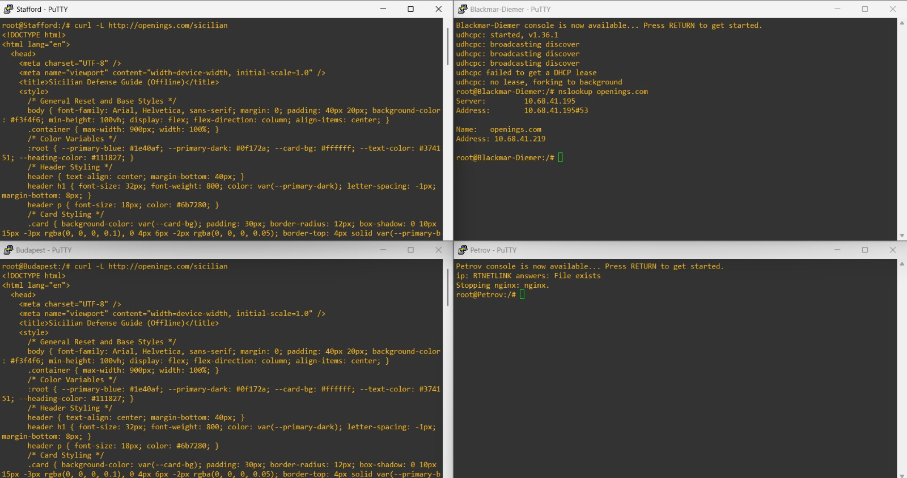

- Explanation
### 1. Konfigurasi DNS Server (Caro-Kann)

Tambahkan zona domain `openings.com` pada file `/etc/bind/named.conf.local`:

```bash
zone "openings.com" {
    type master;
    file "/etc/bind/db.openings";
    allow-transfer { 10.68.41.194; };  # IP Alekhine
    also-notify { 10.68.41.194; };
};
````

Tambahkan file database `/etc/bind/db.openings`:

```bash
$TTL    604800
@       IN      SOA     openings.com. root.openings.com. (
                        2025120101
                        604800
                        86400
                        2419200
                        604800 )
;
@       IN      NS      openings.com.
@       IN      A       10.68.41.219   ; IP Petrov
www     IN      CNAME   openings.com.
```

Restart service:

```bash
service bind9 restart
```

---

### 2. Konfigurasi DNS Slave (Alekhine)

```bash
zone "openings.com" {
    type slave;
    masters { 10.68.41.195; };  # IP Caro-Kann
    file "/var/lib/bind/db.openings";
};
```

Restart:

```bash
service bind9 restart
```

---

### 3. Konfigurasi Reverse Proxy (Petrov)

Install nginx:

```bash
apt-get update && apt-get install -y nginx
```

Konfigurasi di `/myscripts/myconfig/nginx.conf`:

```nginx
user www-data;
worker_processes auto;

pid /myscripts/tmp/nginx.pid;

events {
    worker_connections 768;
}

http {
    include /etc/nginx/mime.types;
    default_type application/octet-stream;

    log_format jarkom_format "[$time_local] Jarkom Node Petrov Access from $remote_addr using method \"$request\" returned status $status with $body_bytes_sent bytes sent in $request_time seconds";

    access_log /myscripts/tmp/access.log;
    error_log /myscripts/tmp/error.log;

    server {
        listen 80;
        server_name openings.com www.openings.com;

        location /sicilian/ {
            proxy_pass http://10.68.41.2/;
            proxy_set_header Host $host;
            proxy_set_header X-Real-IP $remote_addr;
        }

        location /slav/ {
            proxy_pass http://10.68.40.2:8000/;
            proxy_set_header Host $host;
            proxy_set_header X-Real-IP $remote_addr;
        }

        location = /sicilian { return 301 /sicilian/; }
        location = /slav { return 301 /slav/; }
    }
}
```

Jalankan Nginx dengan config kustom: `nginx -c /myscripts/myconfig/nginx.conf`

</br>

## Soal 11

> Tambahkan juga konfigurasi agar request untuk “openings.com/random” akan mengalihkan request ke webserver Sicilian dan Slav dengan algoritma round-robin.  
> _Additionally, configure requests for "openings.com/random" to be redirected to the Sicilian and Slav web servers using a round-robin algorithm._

**Answer:**

- **Screenshot**

  **Hasil Uji Round-Robin (Akses Berulang):**  
  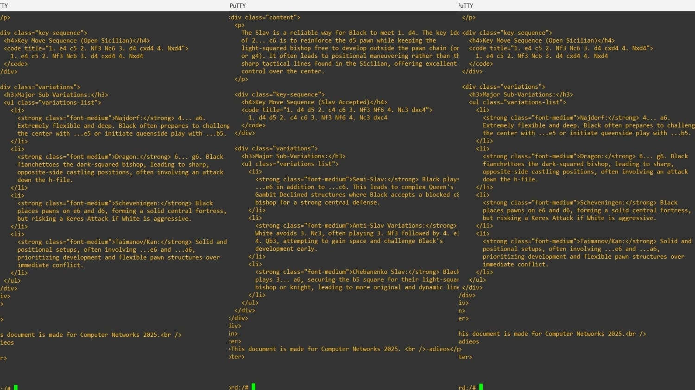

- **Explanation**

  Untuk mengimplementasikan *Load Balancing* dengan algoritma Round-Robin, konfigurasi Nginx pada **Petrov** ditambahkan dengan blok `upstream` dan `location` baru.

  **1. Konfigurasi Upstream Block**  
  Di dalam blok `http` pada file `/myscripts/myconfig/nginx.conf`, didefinisikan grup server bernama `backend_random`. Karena tidak ada metode balancing khusus (misalnya `ip_hash`), Nginx secara default menggunakan **Round-Robin**.

  ```nginx
  http {
      # ...
      
      # Definisi Grup Load Balancing (Round-Robin)
      upstream backend_random {
          server 10.68.41.2;       # Sicilian (Port 80)
          server 10.68.40.2:8000;  # Slav (Port 8000)
      }
      # ...
  }
    ```

**2. Konfigurasi Location Block**
Di dalam blok `server` untuk `openings.com`, ditambahkan route `/random/` yang meneruskan request ke grup upstream tersebut.

```nginx
server {
    # ...
    
    # Route Load Balancing
    location /random/ {
        proxy_pass http://backend_random/;
        proxy_set_header Host $host;
        proxy_set_header X-Real-IP $remote_addr;
    }
    
    # ...
}
```

**3. Verifikasi**
Pengujian dilakukan dengan mengakses `http://openings.com/random/` berulang kali dari client. Hasil menunjukkan respon server bergantian antara halaman Sicilian dan Slav, menandakan algoritma Round-Robin bekerja dengan baik.

</br>

## Soal 12

> Anatoly Parkov berencana untuk melakukan ekspansi secara besar-besaran. Maka dari itu, hapus seluruh konfigurasi Static Routing dan ubah agar seluruh router menggunakan Dynamic Routing. Gunakan protokol RIP!

> _Anatoly Parkov plans to perform a great expansion. Therefore, remove all Static Routing configurations and configure all routers to use Dynamic Routing. Use the RIP protocol!_

**Answer:**

- **Screenshot**

  **Tabel Routing (RIP) dan Tes Koneksi:**
  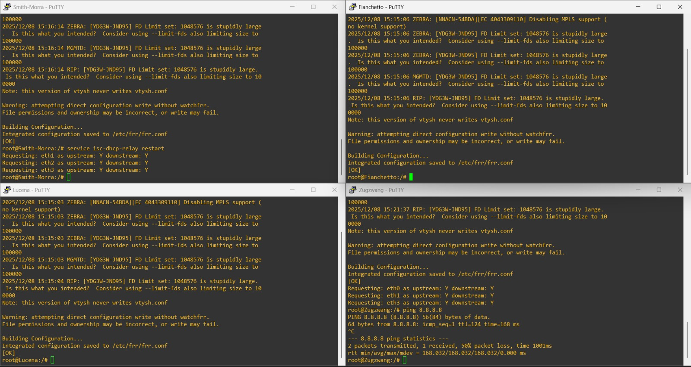

- **Explanation**

  Untuk menggantikan Static Routing dengan **Dynamic Routing (RIPv2)**, digunakan paket routing suite **FRR (Free Range Routing)** pada seluruh router. Konfigurasi dilakukan secara otomatis menggunakan script `post-up` pada file `/etc/network/interfaces`.

  **Tahapan Implementasi:**

  1.  **Pembersihan Static Route:**
      Seluruh perintah `up ip route add` dihapus dari konfigurasi antarmuka jaringan untuk memastikan routing berjalan murni secara dinamis.

  2.  **Instalasi & Aktivasi Service FRR:**
      Karena penghapusan static route memutuskan koneksi internet sementara, script konfigurasi dilengkapi dengan logika *waiting loop* (menunggu ping ke 8.8.8.8) dan *temporary gateway* pada router hilir agar proses instalasi paket `frr` dapat berjalan.
      Service yang diaktifkan meliputi:
      * **Zebra:** Manager kernel routing.
      * **Ripd:** Daemon untuk protokol RIP.
      * **Mgmtd:** Management daemon (Wajib aktif agar `vtysh` dapat mengeksekusi perintah).

  3.  **Konfigurasi RIP (via VTYSH):**
      Konfigurasi disuntikkan langsung menggunakan CLI `vtysh`.
      * **Network Advertising:** Setiap router mengumumkan subnet yang terhubung langsung dengannya menggunakan perintah `network <subnet>`.
      * **Redistribusi Internet:** Router Gateway (**Smith-Morra**) dikonfigurasi dengan `redistribute kernel` dan `redistribute connected`. Hal ini memungkinkan Smith-Morra menyebarkan rute *default gateway* (internet) ke seluruh router lain dalam jaringan.

  **Konfigurasi Final (Fixed):**

  Berikut adalah konfigurasi yang diterapkan pada masing-masing router:

  **1. Router Smith-Morra (Gateway Utama)**
  ```bash
  auto eth0
  iface eth0 inet dhcp
      # Logika Tunggu Internet & Install Paket
      post-up sh -c 'while ! ping -c 1 -W 1 8.8.8.8 > /dev/null; do sleep 1; done'
      post-up apt-get update -qq || true
      post-up DEBIAN_FRONTEND=noninteractive apt-get install frr iptables isc-dhcp-relay -y -qq || true

      # NAT & Firewall
      post-up iptables -t nat -A POSTROUTING -o eth0 -j MASQUERADE
      # ... (Rule Firewall Soal 13 & 14) ...

      # Konfigurasi RIP
      post-up /usr/lib/frr/zebra -d || true
      post-up /usr/lib/frr/mgmtd -d || true
      post-up /usr/lib/frr/ripd -d || true
      
      post-up sleep 5
      post-up vtysh -c "conf t" -c "router rip" \
      -c "network 10.68.0.0/19" \
      -c "network 10.68.32.0/21" \
      -c "network 10.68.41.224/30" \
      -c "redistribute kernel" \
      -c "redistribute connected" \
      -c "exit" -c "exit" -c "write" || true
      ```
**2. Router Fianchetto**
```bash
auto eth0
iface eth0 inet static
    address 10.68.41.210
    netmask 255.255.255.248
    
    # Pancingan Gateway Sementara (Agar bisa install FRR)
    up ip route add default via 10.68.41.226 || true
    
    # Install & Config FRR
    post-up apt-get update -qq && DEBIAN_FRONTEND=noninteractive apt-get install frr -y -qq
    post-up /usr/lib/frr/zebra -d
    post-up /usr/lib/frr/mgmtd -d
    post-up /usr/lib/frr/ripd -d
    
    post-up sleep 5
    post-up vtysh -c "conf t" -c "router rip" \
    -c "network 10.68.41.208/29" \
    -c "network 10.68.41.224/30" \
    -c "exit" -c "exit" -c "write"
```
**3. Router Lucena**
```bash
auto eth1
iface eth1 inet static
    address 10.68.41.209
    netmask 255.255.255.248

    # Pancingan Gateway Sementara
    up ip route add default via 10.68.41.210 || true

    # Config FRR
    post-up /usr/lib/frr/zebra -d
    post-up /usr/lib/frr/mgmtd -d
    post-up /usr/lib/frr/ripd -d
    
    post-up sleep 5
    post-up vtysh -c "conf t" -c "router rip" \
    -c "network 10.68.41.128/26" \
    -c "network 10.68.41.208/29" \
    -c "exit" -c "exit" -c "write"
```

**4. Router Zwischenzug**
```bash
auto eth0
iface eth0 inet static
    address 10.68.41.211
    netmask 255.255.255.248

    # Pancingan Gateway Sementara
    up ip route add default via 10.68.41.210 || true

    # Config FRR
    post-up /usr/lib/frr/zebra -d
    post-up /usr/lib/frr/mgmtd -d
    post-up /usr/lib/frr/ripd -d
    
    post-up sleep 5
    post-up vtysh -c "conf t" -c "router rip" \
    -c "network 10.68.41.208/29" \
    -c "network 10.68.41.216/29" \
    -c "exit" -c "exit" -c "write"
```

**5. Router Zugzwang**
```bash
auto eth0
iface eth0 inet static
    address 10.68.41.218
    netmask 255.255.255.248
    
    # Pancingan Gateway Sementara
    up ip route add default via 10.68.41.217 || true

    # Config FRR
    post-up /usr/lib/frr/zebra -d
    post-up /usr/lib/frr/mgmtd -d
    post-up /usr/lib/frr/ripd -d
    
    post-up sleep 5
    post-up vtysh -c "conf t" -c "router rip" \
    -c "network 10.68.41.216/29" \
    -c "network 10.68.41.0/25" \
    -c "network 10.68.41.192/28" \
    -c "network 10.68.40.0/24" \
    -c "exit" -c "exit" -c "write"

    # DHCP Relay & IPTables Checksum (Tetap diaktifkan)
    post-up iptables -A POSTROUTING -t mangle -p udp --dport 67:68 -j CHECKSUM --checksum-fill
    post-up service isc-dhcp-relay restart
```

</br>

## Soal 13

> Untuk meningkatkan keamanan, konfigurasikan firewall **Smith-Morra** untuk melakukan pembatasan koneksi SSH ke server DNS. Drop semua packet SSH yang berasal dari seluruh client yang memiliki tujuan ke **Caro-Kann** atau **Alekhine.**

> _To increase security, configure the **Smith-Morra** firewall to restrict SSH connections to the **DNS server.** Drop all SSH packets from all clients destined for **Caro-Kann** or **Alekhine.**_

**Answer:**

- **Screenshot**

  **Hasil Tes Koneksi SSH (Connection Refused/Time Out):**
  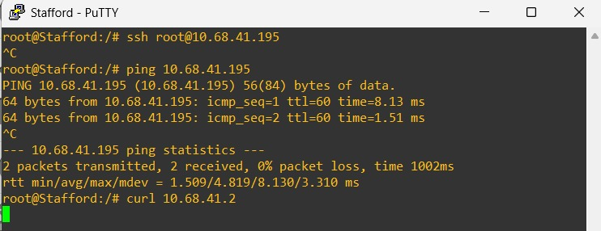

- **Explanation**

  Konfigurasi firewall dilakukan pada router **Smith-Morra** yang bertindak sebagai gateway. Aturan diterapkan pada rantai `FORWARD` karena paket berasal dari client dan hanya melewati router menuju server.

  Berikut adalah konfigurasi yang ditambahkan pada `/etc/network/interfaces` menggunakan script `post-up`:

  1.  **Mencegah Koneksi SSH:**
      Aturan ini memblokir paket TCP dengan tujuan port 22 (SSH) yang mengarah ke IP DNS Master dan Slave.
      
      ```bash
      # Blokir SSH ke Caro-Kann (DNS Master)
      iptables -A FORWARD -d 10.68.41.195 -p tcp --dport 22 -j DROP
      
      # Blokir SSH ke Alekhine (DNS Slave)
      iptables -A FORWARD -d 10.68.41.194 -p tcp --dport 22 -j DROP
      ```

  2.  **Mekanisme:**
      IPTables akan mencocokkan paket yang masuk. Jika paket tersebut ditujukan ke IP Server DNS dengan protokol TCP port 22, paket akan langsung dibuang (`DROP`) sehingga koneksi tidak akan pernah terbentuk.

</br>

## Soal 14

> Nampaknya, web server juga manusia sehingga hanya ingin bekerja di hari kerja. Maka dari itu, semua client hanya bisa mengakses **Sicilian** dan **Slav** pada hari Senin-Jumat pada pukul 09:00-17:00.

> _Apparently, web servers are humans too, so they only want to work on weekdays. Therefore, all clients can only access **Sicilian** and **Slav** on Monday through Friday, 9:00 AM to 5:00 PM._

**Answer:**

- **Screenshot**

  **Hasil Tes Akses Web (Sesuai Waktu):**
  

- **Explanation**

  Untuk membatasi akses berdasarkan waktu, digunakan modul `-m time` pada IPTables di router **Smith-Morra**. Logika yang digunakan adalah **Whitelist**: Izinkan akses pada jam kerja, lalu blokir sisanya.

  Berikut adalah konfigurasi yang diterapkan:

  1.  **Akses ke Sicilian (Port 80):**
      ```bash
      # 1. Izinkan akses pada Senin-Jumat, 09:00 - 17:00
      iptables -A FORWARD -d 10.68.41.2 -p tcp --dport 80 -m time --timestart 09:00 --timestop 17:00 --weekdays Mon,Tue,Wed,Thu,Fri -j ACCEPT
      
      # 2. Blokir akses selain waktu di atas
      iptables -A FORWARD -d 10.68.41.2 -p tcp --dport 80 -j DROP
      ```

  2.  **Akses ke Slav (Port 8000):**
      ```bash
      # 1. Izinkan akses pada Senin-Jumat, 09:00 - 17:00
      iptables -A FORWARD -d 10.68.40.2 -p tcp --dport 8000 -m time --timestart 09:00 --timestop 17:00 --weekdays Mon,Tue,Wed,Thu,Fri -j ACCEPT
      
      # 2. Blokir akses selain waktu di atas
      iptables -A FORWARD -d 10.68.40.2 -p tcp --dport 8000 -j DROP
      ```

  **Analisis:**
  IPTables membaca aturan dari atas ke bawah.
  * Jika akses dilakukan pada jam kerja (misal: Senin 10:00), paket akan cocok dengan aturan pertama dan di-`ACCEPT`.
  * Jika akses dilakukan di luar jam kerja (misal: Sabtu atau Malam hari), paket akan melewati aturan pertama dan lanjut ke aturan kedua, di mana paket akan di-`DROP`.

</br>

## Soal 15

> Terakhir, Gerry Paskarov berpesan untuk selalu melakukan logging, sehingga konfigurasikan fitur logging untuk melakukan log terhadap seluruh paket yang di-DROP pada firewall **Smith-Morra.**

**Answer:**

- **Screenshot**

  **Bukti Logging & Drop (Packet Counters Meningkat):**
  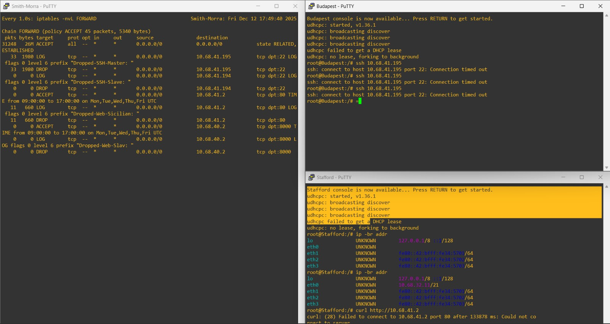

- **Explanation**

  Untuk memastikan aturan logging dan dropping bekerja, verifikasi dilakukan dengan memantau statistik paket pada IPTables menggunakan perintah `iptables -nvL FORWARD`.

  **Analisis Screenshot:**
  1.  **Rule Logging:** Terlihat aturan dengan target `LOG` memiliki counter paket (`pkts`) yang terus bertambah. Ini membuktikan bahwa sebelum paket dibuang, sistem berhasil mencatatnya ke dalam kernel log.
  2.  **Rule Drop:** Tepat di bawah aturan log, terdapat aturan `DROP` dengan jumlah paket yang sama atau lebih besar. Ini membuktikan bahwa paket-paket ilegal (seperti akses SSH ke DNS atau akses Web di luar jam kerja) berhasil diblokir oleh firewall.

  Kenaikan angka pada kolom `pkts` adalah bukti valid bahwa trafik dari client telah "menabrak" aturan firewall yang telah dikonfigurasi.

</br>
  
## Problems
capek bgt huhuhuhuhuhuhuhuhuhu terima kasih jarkom

## Revisions (if any)
no 11, 12, dan 15
